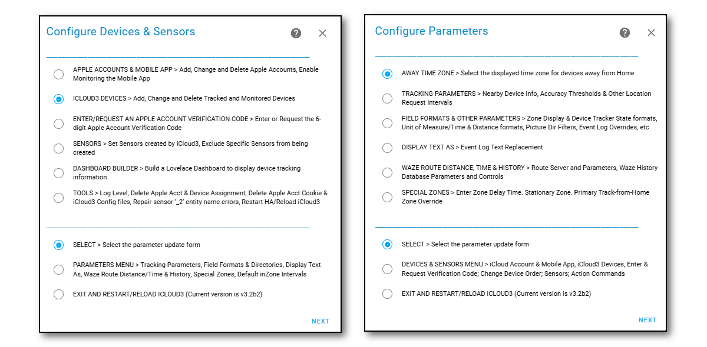
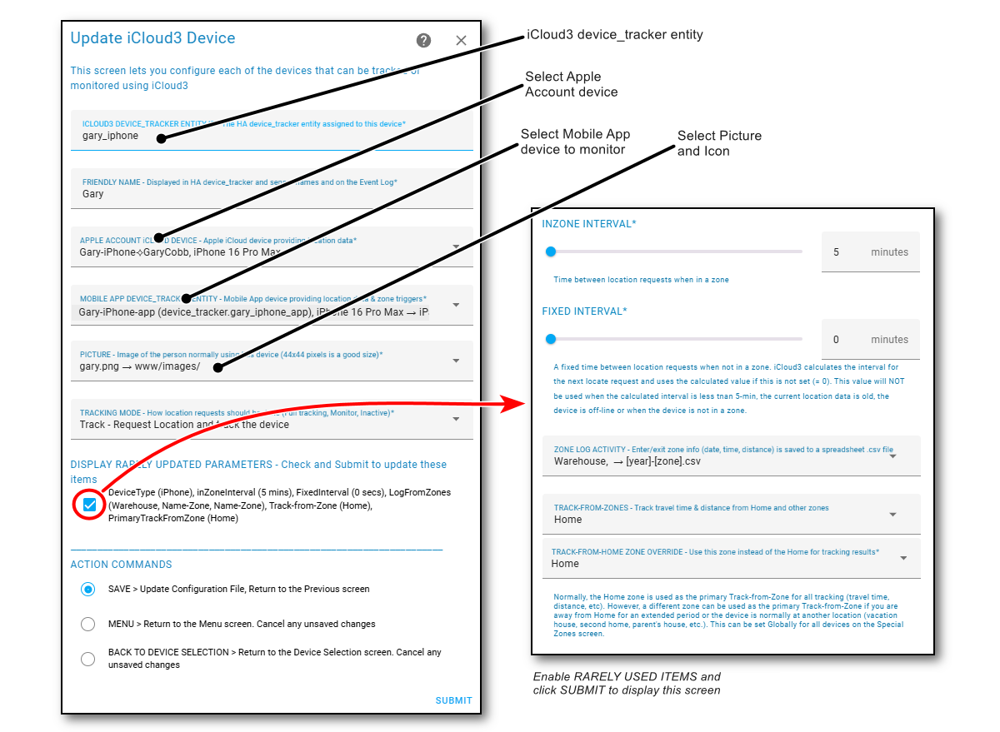

## iCloud3 Components   <!-- {docsify-ignore} -->

There are 3 major parts to the iCloud3 custom component that are used to configure, track and report device location information. They are:

- **iCloud3 Device Tracker** - This monitors the device's location, determines when the device should be located next and updates all the sensors
- **Event Log** - Shows a devices location, how the location changes, the results of location updates, errors, and startup information
- **Configure Settings** - Set up all the iCloud3 tracked devices, Apple Accounts, sensors and other parameters

This section describes each of these items.

------

### iCloud3 Device Tracker

The iCloud3 Custom Component provides the core device tracking service. It does the following:
  - Initializes and sets up all tracking activities for the Devices using location data from iCloud Location Services or the Mobile App device_tracker entity (or both).

  - Monitors the Mobile App device_tracker entity for location changes, zone enter/exit triggers and battery information.

  - Requests and processes location data from iCloud Location Services and the Mobile App.

  - Analyzes the location data and tracks the devices.

  - Updates the sensors associated with each device.

    

The screens below show examples of a tracked device's current status. The following is displayed:

- Gary, on the left, is at Home. Lillian, on the Right is Away.
  - Arrive item - The icons and text show Gary is at Home (Home icon in a circle and he arrived home at @3:22p. Lillian is traveling towards home. Notice the distance, travel time and travel direction from the Home Zone. 
- Notice when the device was last located by iCloud or the Mobile App, when it was last updated by iCloud3 and the time of the next update. 
- Gary is tracking from Home and the Quail Zone, Lillian just from Home.
- The *Info* field shows tracking results from nearby devices is being used.

> The Lovelace code for these screens is in [Step #5 - Set up a Lovelace card tracking card](.../2.0-installing-and-configuring?id=step-6-set-up-a-lovelace-card-tracking-card) 

------

### Event Log

The Event Log is a Lovelace custom card that shows past and current activity related to tracking a device. This includes:

- Startup configuration.
- Device information for Apple account and Mobile App devices and entities
- Tracking results including zone, travel time and distance data
- Error messages, problems and location data issues
- Detail tracking monitors that show what is going on under the covers, how location data from the iCloud Location Services and the Mobile App is analyzed and processed

#### Actions command

The *Actions* command on the Event Log is used to control iCloud3 operations. This includes:
- Restart iCloud3 without restarting Home Assistant
- Pause and resume tracking
- Relocate all devices or a specific device
- Issue a *Find My Device* alert
- Export the Event Log to a text file
- Show/hide tracking monitors
- Set the Log Level (info, debug, rawdata) indicating the type of data to write to the *icloud3.log* file
- Run Waze History Database maintenance functions

Note: The Event Log is installed into the *config/www/icloud3* directory. This directory can be changed on the *Configure > Parameters Menu > Field Formats and Event Log Overrides* screen but there is really no need to do that.

#### Quick Link Icons

The icons above the *Actions* command menu list in the top-right are used for various iCloud3 activities.

| Icon                                                      | Description                                                  |
| --------------------------------------------------------- | ------------------------------------------------------------ |
|  | **Refresh** - This updates the Event Log screen with new activity for the selected device. |
|                      | **Buy Me a Coffee** - You find iCloud3 useful, appreciate the work I have done and want to send me a few dollars, euros, pesos, pounds, etc. Thanks. I appreciate it. |
|                      | **GitHub Issue** - You are having a problem and think you may have found a bug or other problem. This takes you to the iCloud3 GitHub Issues page to create a new issue or to review existing issues. |
|                      | **Configure** - This is a shortcut to the *HA Settings > Integrations > iCloud3* screen. Select *Configure* to display the various configuration screens. |
|                        | **User Manual** - This opens the iCloud3 User Manual.        |

------

###  Configuration Screens

The iCloud3 configuration screens are used to:
- Add and update Apple accounts
- Add and update tracked and monitored devices. You can assign the Apple account device and Mobile App device that provides location and other data, zone and tracking parameters, a picture or icon, etc
- Select the sensors to be updated during tracking operations
- Run special Tools to fix configuration problems
- Configure other tracking and formatting parameters
- Set up Special Zones and specify how Waze Route Tracking should be configured

  

#### Open the Configuration screens

There are two ways to open the Configuration Screens. 

- Select the    **Configure Icon** shortcut on the *Event Log screen* 
   Then select **Configure** 
   *or*   
-  Select from the HA Dashboard using **☰ > HA Settings > Devices & Services > Integrations > iCloud3** screen
   Then select **Configure**

> The Configure Icon shortcut is not available when you first install the iCloud3 integration. It will be available after the Event Log card has been setupit.

The *Configure Devices & Sensors* menu is displayed when you select *Configure*. Toggle between the two menus by selecting it from the Action list at the bottom of the screen.

#### Configure Devices & Sensors Menu screen

- Setup the data sources that are used to provide location data to iCloud3 (Apple iCloud Location Service and the Mobile App)
- Setup and update the Apple Accounts containing the devices you want to track
- Setup and update iCloud3 tracked devices
- Select the sensors that report device and tracking results
- Authenticate access to the Apple account with the 6-digit verification code
- Select how a sensor's time value and the time values in the Event Log should be displayed If you are away from home and in another time zone. You can show show the local time or the time of your HA server.
- Various utility tools for resetting configuration parameters, resetting and cleaning up bad data and other miscellaneous actions used for solving problems

#### Configure Parameters Menu screen

- Setup various tracking parameters dealing with time, accuracy, distances, etc.
- Setup how data should be formatted on the sensors and Event Log
- Change the text strings should be shown on the Event log
- Setup Waze Route information and Waze Route History
- Setup sensors changes when entering non-monitored zones, stationary zones that can be used when in a non-zone location for an extended period of time and using a pseudo home zone when away from home
- Setup default inZone time intervals 

#### Selection and Parameter Update screens

Select the parameter or other screen you want to view from the screen list on the menus.

1. Select the **Screen Name** from the option list at the top of the menu screen
2. Select **Select** from the option list at the bottom part of the menu screen
3. Select **Next**

> Select the Menu screen at the bottom to toggle between the menus

The screen you selected will be displayed It generally has two parts:

- **Top Part - Item Selection or Parameter Entry** - This is used to select a task to be done, select an Apple account or Device to be updated, select an item from a list and entering and configuring parameters, etc
- **Bottom Part - Command or Action to be done** - First select the desired option (Select/Next/Add/Update/Delete/etc.), then select the command i(Submit/Next/Last) in the bottom right-hand corner. Some screens will launch other screens for additional parameters, action confirmation, menu options, etc.

These example screens show these 2-sections. 

