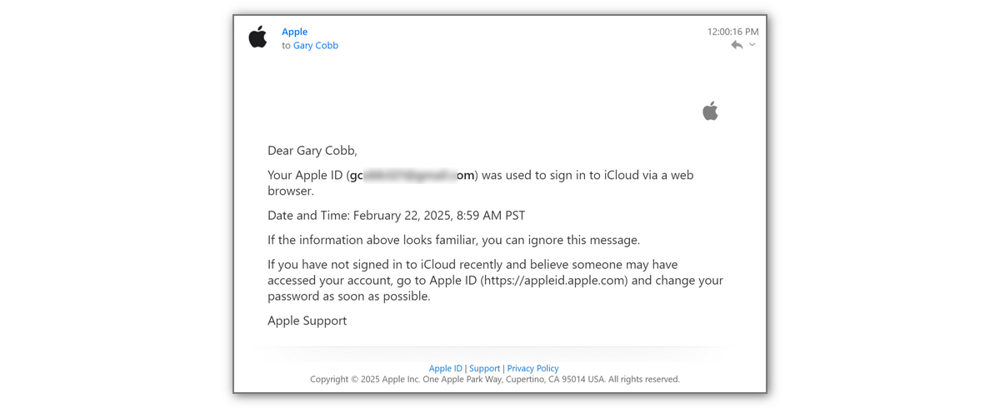

# Apple Account <!-- {docsify-ignore} -->

The Apple Account is the primary source of location data for iCloud3. It provides information related to the iPhones, iPads, Watches  and other devices in the Family Sharing list to the devices that are tracked and monitored.

### Assigning the Apple Account Device to the iCloud3 tracked device

The Apple Account device is assigned to the the iCloud3 tracked device on the *Configure > Update iCloud3 Device* screen, *Apple Account iCloud Device* field. It is selected from the list of available devices in the Apple Account.

### Enable Location Sharing

Location Sharing must be enabled on all Apple devices that are tracked by iCloud3.

- **Settings App > Apple Account > Family > Location Sharing** screen
  - Enable *Share your location with* and *Automatically Share Location*
- **FindMy App > Me** screen
  - Enable *Share My Location*

!> The location of the devices you are tracking must be displayed on the *FindMy App > People* Map screen. If it is not displayed here, it's location is not shared and will not be returned to iCloud3 when it is requested.

### Apple Account Authentication

When iCloud3 logs in the first time and about every 2-3 months after that, access to your Apple Account will be required. Various notifications are displayed on your Apple devices:

- The *Apple Id Sign in Requested > Don't Allow/Allow* popup window id displayed on the trusted devices.
- An *Apple Account Authentication is Required* message is displayed in the Event Log.
- An alert is sent to your devices by iCloud3.

> See [here](https://support.apple.com/en-us/HT205064) for additional information from Apple Support about your Trusted Devices.

When you select *Allow* the 6-digit verification code is displayed. This 6-digit verification code must be entered to allow iCloud3 to continue accessing your Apple Account for location data.

1. Open the *Configure > Enter/Request an Apple Account Verification Code* screen. 
2. Verify the Apple Account requesting authentication is displayed, it will show *Authentication Required*. Select it if necessary.
3. Enter the code and select Submit. The code will be sent to Apple.

The code is valid for about 15-minutes. A *Verification Code Accepted* message is displayed if it is accepted by Apple. If the code rejected, request a new code on the same screen. This will display a new *Apple Id Sign in Requested* window on the Trusted with a new code. 

### Requesting a new 6-digit Verification Code

The verification code is valid for about 15-minutes after it is first displayed. If you are not able to enter it immediately. that code will be rejected when you enter it on the *Configure > Enter/Request an Apple Account Verification Code* screen. 

1.  Select *Request a new Apple Id Verification Code and select Submit. This will display a new *Apple Id Sign in Requested* window on the Trusted with a new code.
2. Enter it and select Submit. The new code will be sent to Apple and access will be granted.

### Login email Notification from Apple

An email is sent from Apple when you log into your your iCloud account using your password. You will receive this email:

- When you are setting up iCloud3 and you login the first time
- Every time the password is used to log into your account. This may be several times or more during the day.

!> You will receive a number of these emails from Apple each day while iCloud3 is tracking your devices. The number you receive is determined by Apple, iCloud3 can not do anything about this.  iCloud3 minimizes the number you receive as best it can by using tokens first and only logging in when Apple requests one.

####  What can you do to minimize these emails from clogging up your inbox

The short answer is not much. 

I have set up a gmail filter that detects the email from Apple, marks it as read, bypasses the inbox and puts it in a special Apple email folder. Some have said they are concerned about someone hacking into their Apple account, they will not know about it and do not want to use these automatic filters. A valid concern but this works for me. I would welcome any other suggestions I might add to this User Guide to help others deal with this problem.

#### Monitoring the emails from Apple

Although the chance of someone else successfully logging into your Apple Account is almost impossible, especially where 2fa is now required, you may want to review the times iCloud3 logs in with your password and compare these logins with the email you receive. 

1. Select *Event Log > Actions > Show Startup Logs, Errors and Alerts*. 

   Scroll through the items for an entry similar to this. Logins during the startup process are in the Stage 4 area while logins during normal tracking are shown near the top of the list. 

   

2. Refresh the Event Log or select a device to redisplay the tracking screen.

### App Specific Password

App Specific Passwords can not be used with iCloud3. Apple does not provide an interface for web based programs like iCloud3 to use them. They can only be used by Apps installed on the iPhone or iPad. 

Try to log into your Apple Account at www.icloud.com from a browser. Use your username and the App Specific Password. It will fail.

### Hardware Security Keys like Yubikey

Hardware security keys can not be used with iCloud3 to authenticate access to your Apple Account. 

If are using a Yubikey or other hardware key for your Apple Account and get an authentication request or if you request a new verification code, you will get the window requesting Apple account access approval as you normally do. You can approve the access but there is no method of linking that approval to iCloud3.

### Tracking an Apple Watch

The Watch is tracked like any other iPhone or iPad. It is added on the *iCloud3 Devices* screen and configured on the *Update Devices* screen. 

Although the Mobile App Complication can be installed on the Apple Watch, there are a number of limitations regarding tracking :

- It does not provide location information.
- It will not receive notifications sent from iCloud3.
- Set the *Mobile App device* to *None*
- Set the *inZone Interval* to 15-minutes or less to minimize the delay when the device enters or exits a zone.
- Only assign a *Family Sharing* device to the tracked Watch device.

### Tracking AirTags

These devices can not be tracked. They are not tracked by Apple like an iPhone or iPad and location information is not returned from iCloud Location Services for them.

### Family Sharing vs Owner's Devices when using several Apple Accounts

This applies only when you are tracking devices using several Apple Accounts. If only one Apple Account is being used, all devices in the Family Sharing List are located on each location request sent to Apple.

When a device needs to be located, iCloud3 sends a location request to Apple. Apple locates <u>all</u> devices on the Family Sharing List, not just the one that issued the request. iCloud3 receives the location information and updates all tracked and monitored devices with the new information.

However, when you are using several Apple Accounts and both apple accounts are sharing the same devices, you can limit the devices located during a location request to those 'owned' by that Apple Account. There are benefits and determents associated with each method.

- Improved response time when an Apple account's devices are being located since Apple does not have to locate all the devices in the Family Sharing list. 
- Additional location requests must be sent to Apple to locate the devices on the other Apple account

For example: You have an Apple account with an iPhone and iPad (you are the owner) and your spouse has an iPhone and iPad (the spouse is the owner).

- Family Sharing devices - You and your spouse's iPhones and iPads are all located (4-devices) whenever one device is located. This can reduce the number of location requests sent to Apple, especially if the devices are close to each other. However, it takes Apple longer to locate all of them and it may return an old location if the device takes too long to locate. 
- Owner's Devices - When one of your devices needs to be located, the location request sent to Apple is only for your iPhone and iPad (2-devices). Your spouse's devices are not located at that time. Another location request is sent to Apple for them when they need to be located.

This is configured on the *Configure > Update Apple Account Username/Password* screen, *Always Locate All Devices* field.

- Enable - If the devices are usually located close to each other
- Disable - If this is another family members or a friends account

### Event Log Apple Account Configuration

When iCloud3 starts, Stage 4 handles setting up the Apple Account and Mobile App devices. The following is done:

- Verify the Username/Password
- Read all of the devices in the Apple Account
- Match them up with the iCloud3 device using the Apple Account iCloud Device parameter from the *Update iCloud3 Device* screen
- Errors are identified. This includes login errors, missing devices, duplicate devices, authentication, changed device names, etc.

The results are shown in the *Event Log > Stage 4* screens. 

### Apple Account Cookie and Session Files

Apple Account cookies and session data is stored in the *config/.storage/icloud3.apple_acct* directory for each Apple Account being used. These *cookie* and *session* files store tokens that are used to access your iCloud account without requesting a 6-digit verification code every time you start iCloud3 or request location data.

Changing and deleting these files will cause reauthentication requests from Apple and termination of your current login session and should not generally be done. These files can be deleted on the *Configure > Tools* screen.

### China Users

A different URL is used to access the Apple Account servers in China (.cn is added to the URL). This is configured on the *Update Apple Account Username/Password* screen, *Apple Server Location* field. 

This selection field is displayed when the Home Assistant country code is `cn` or `hk`.

Set the *Configure > Parameter Menu > Field Formats & Other Parameters*, *Apple Server Location* field to Enabled to always display this selection field.

### Upgrading to a new Device (Ex.: iPhone 15 to iPhone 16)

The device's name (*Gary iPhone*) selected from the above list is stored in the iCloud3 configuration file. This is used to determine the actual Apple device providing location data when iCloud3 starts.

Several events take place when you upgrade a device, i.e, replace an iPhone 15 with an iPhone 16. 
- The apps, data and settings are transferred from the iPhone 15 to the iPhone 16.
- In this example, the name is on the iPhone 16 Pro Max is *Gary iPhone*. 
- A new name is assigned to the iPhone 16 Pro Max, i.e, *Gary iPhone (2)*.
- The iPhone 15 is assigned a new *device_id* by Apple. This *device_id* is used internally by Apple and you never see it. It is used, however, by iCloud3 to identify the actual device providing location data.
- The iPhone 15 is removed from the *FindMy App* and the Apple iCloud account and traded-in or sold.

At this time, iCloud3 is still tracking the *Gary iPhone/iPhone 15* that is no longer on your iCloud account instead of the new iPhone.

**Easy way** - The following steps should be done to make it easier to identify and transfer to the new iPhone:

- Rename the iPhone 15 from *Gary iPhone* to *Gary iPhone 15*. 
- Rename the iPhone 16 Pro Max from *Gary iPhone 15 (2)* back to *Gary iPhone* after you transfer the apps, data and settings.
- Restart iCloud3.

Since the new iPhone 16 Pro Max is now the *Gary iPhone* device, it will be now be assigned to the same iCloud3 tracked device.

**Harder way** - You realize that *Gary iPhone* is no longer being tracked because the iPhone is no longer on your Apple iCloud account or it has been wiped and powered off. 
- Restart iCloud3 - The Apple Account device list will be rebuilt with the current name.
  - Reconfigure the iCloud3 device on the *Update iCloud3 Device* screen - Select the new iPhone from the Apple Account iCloud Device list. 
  - Exit the Configure screens - iCloud3 will be restarted and the new iPhone's name will be assigned to the iCloud3 tracked device.
- Or, 
  - Change the name on the iPhone 16 Pro Max from *Gary iPhone (2)* to *Gary iPhone*.
  - Wait a few minutes until this name is re-registered with the Apple account.
  - Restart iCloud3 to reassign the name to the iCloud3 tracked device.

