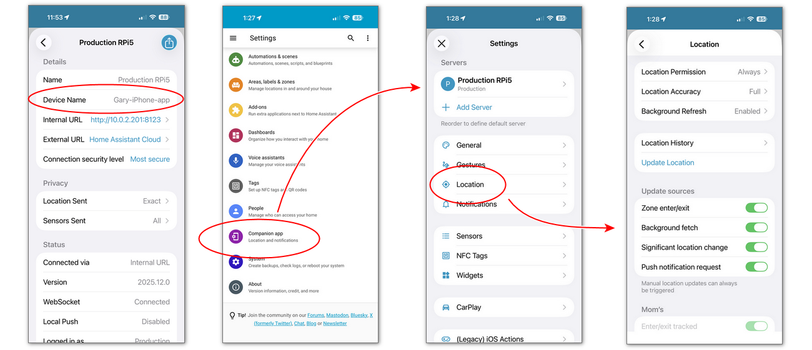
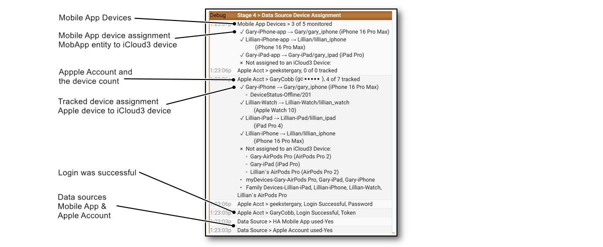

## HA Companion Mobile App Devices  <!-- {docsify-ignore} -->

iCloud3 monitors the Mobile App device_tracker entity and several sensors for:

-  zone enter/exit triggers
- location changes
- battery level updates. 

The sensors are monitored for changed data every 5-seconds. iCloud3 also sends messages to the Mobile App when an error occurs and when a location update from the Mobile App is needed.

### Results of not installing the Mobile App

iCloud3 does not require the Mobile App to be installed on an iPhone or iPad. However, if it is not installed, the following happens:

- iCloud3 will not react to a Zone Enter or Exit events until the phone's *Next Update Event* time. This will delay the device entering a zone or exiting from it.
- Significant location changes will not be available.
- The device's battery level is not available.
- Notifications can not be sent to the device.
- In this case, a short *inZone Interval* will help reduce the time between location updates.

The documentation for the Home Assistant Companion can be found [here](https://companion.home-assistant.io/). It is very extensive and explains how to set it up and use it.  ay particular attention to:
- Setting it up [here](https://companion.home-assistant.io/docs/getting_started/)
- Location [here](https://companion.home-assistant.io/docs/core/location)
- Sensors [here](https://companion.home-assistant.io/docs/core/sensors)
- Notifications [here](https://companion.home-assistant.io/docs/noticationsnotifications-basic)

### Assigning the Mobile App device_tracker to the iCloud3 tracked device

The Mobile App device is assigned to the the iCloud3 tracked device on the *Configure > Update iCloud3 Device* screen, *Mobile App device_tracker entity* field. It is selected from the list of available Mobile App devices. Alternatively, you can scan for the first Mobile App device whose name starts with the iCloud3 device name (ScanFor: gary_iphone).

### Using the Mobile App with the Apple Watch

Only iPhones and iPads with the Mobile App installed are monitored. Although there is an HA Complication that can be installed on the Apple Watch, it does not provide location information so it is not monitored. iCloud3 attempts to trigger zone exits by requesting an Apple Account location update when a nearby iPhone or iPad receives a zone exit trigger.

### Install and Configure the Mobile App

The Mobile App is not required for iCloud3 to track devices. But it helps and it's benefits have already been discussed. It can be installed on some of your iDevices and not others. 

The screens below shows the configuration settings for the Mobile App:

### Add the Mobile App Integration to Home Assistant

The Mobile App Integration is added to HA on the Integrations screen. It provides the link between the device itself and the device_tracker and sensor entities on the HA sever. There are a lot of sensor entities created by the Mobile App. iCloud3 monitors the only the device_tracker entity and the last_update_trigger and battery sensor entities. The rest can be disabled, hidden or left alone.

### Clearing the Mobile App Cache

The cache needs to be cleared when a new version of the Event Log is installed. This does not happen very often, usually when major iCloud3 version is released. A message, with instructions, is displayed when this is needed. It will need to be cleared on every device (iPhones, iPads) that is using the Mobile App. 

1. In the *Home Assistant Companion App*, tap **☰ > HA Settings > Companion App.**
2. Tap **Debugging > Reset front end cache**
3. Tap **Settings > Done**
4. Refresh the screen by pulling down on it until the refresh symbol displays. This will reload the screen and iCloud3 Event Log from the HA server.

### Event Log Mobile App Configuration

When iCloud3 starts, Stage 4 handles setting up the Apple Account and Mobile App devices. The following is done:

- Read all of the devices in the Mobile App integration
- Match them up with the iCloud3 device using the Mobile App device_tracker parameter from the *Update iCloud3 Device* screen
- Errors are identified. This includes missing device_tracker entities, duplicate devices, etc.

The results are shown in the *Event Log > Stage 4* screens. 

