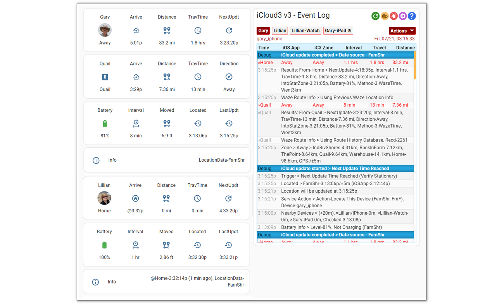

## 1.2 Event Log  <!-- {docsify-ignore} -->

The Event Log is a Lovelace custom card that shows past and current activity related to tracking a device. This includes:

- Startup configuration.
- Device information for Family Sharing, Find-my-Friends and iOS App devices and entities.
- Tracking results including zone, travel time and distance data.
- Error messages, problems and location data issues.
- Detail tracking monitors that show what is going on under the covers, how location data from the iCloud Location Services and the iOS App is analyzed and processed.

The Event Log has an *Actions* command menu that can control iCloud3 operations and the type of information to display in the Event Log or the Home Assistant log file. This includes:

- Restart iCloud3 without restarting Home Assistant
- Pause and resume tracking
- Relocate all devices
- Issue a *Find My Device* alert
- Export the Event Log to a text file
- Show/hide tracking monitors
- Start/stop detailed debugging that will dump set up information and all raw data received from iCloud Location Services.

Note: The Event Log is installed into the *config/www/icloud3* directory. This directory can be changed on the *Configure Settings > Tracking & Other Parameters* screen on Menu page #2.

#### 1.2.1 Quick Link Icons

The icons above the *Actions* drop-down menu list in the top-right are used for various iCloud3 activities.

| Icon                                                      | Description                                                  |
| --------------------------------------------------------- | ------------------------------------------------------------ |
|  | **Refresh** - This updates the Event Log screen with new activity for the selected device. |
|                      | **Buy Me a Coffee** - You find iCloud3 useful, appreciate the work I have done and want to send me a few dollars, euros, pesos, pounds, etc. Thanks. I appreciate it. |
|                      | **GitHub Issue** - You are having a problem and think you may have found a bug or other problem. This takes you to the iCloud3 GitHub Issues page to create a new issue or to review existing issues. |
|                      | **Configure Settings** - This opens the iCloud3 Configure Settings screen. This will open a new browser page. It will only work when you are connected to your local network. It may not work on iPads and iPhones using the iOS App. |
|                        | **User Manual** - This opens the iCloud3 User Manual.        |

