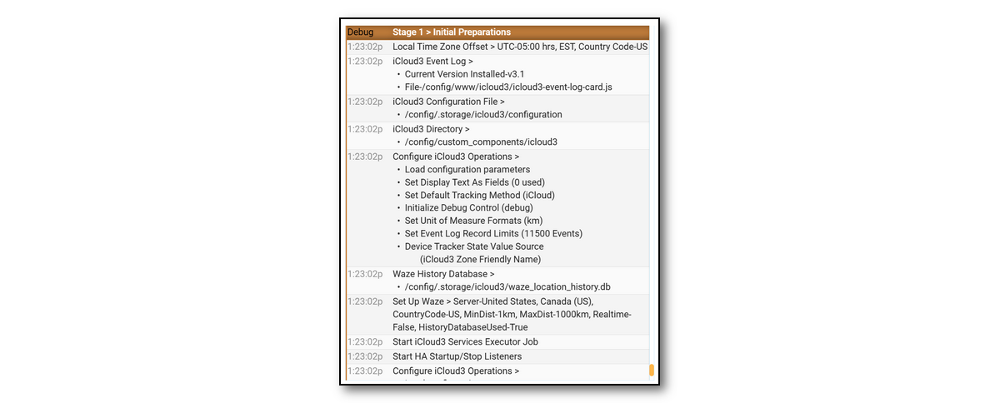
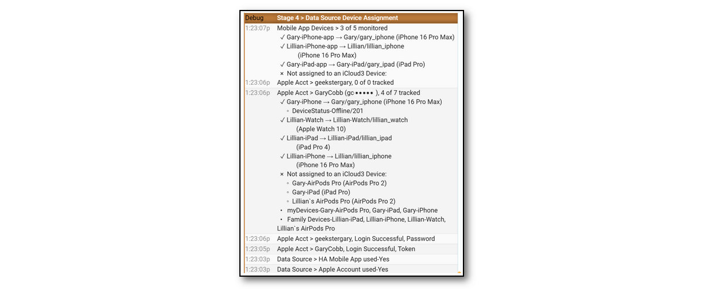
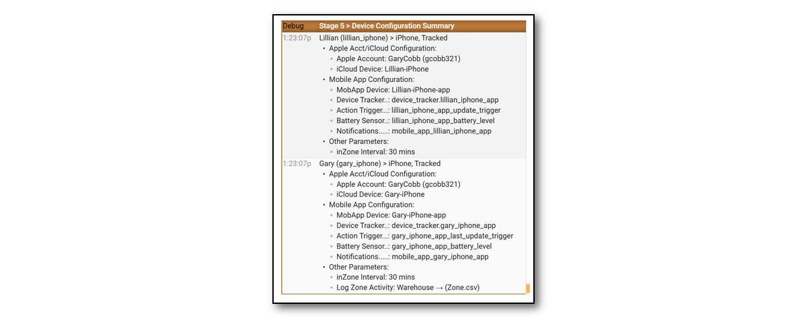

## Event Log  <!-- {docsify-ignore} -->

The Event Log is a Lovelace custom card that shows past and current activity related to tracking a device. This includes:

- Startup configuration.
- Device information for Family Sharing, Find-my-Friends and iOS App devices and entities.
- Tracking results including zone, travel time and distance data.
- Error messages, problems and location data issues.
- Detail tracking monitors that show what is going on under the covers, how location data from the iCloud Location Services and the iOS App is analyzed and processed.

The Event Log has an *Actions* command menu that can control iCloud3 operations and the type of information to display in the Event Log or the Home Assistant log file. This includes:

- Restart iCloud3 without restarting Home Assistant
- Pause and resume tracking
- Relocate all devices
- Issue a *Find My Device* alert
- Export the Event Log to a text file
- Show/hide tracking monitors
- Start/stop detailed debugging that will dump set up information and all raw data received from iCloud Location Services.

Note: The Event Log is installed into the *config/www/icloud3* directory. This directory can be changed on the *Configure Settings > Tracking & Other Parameters* screen on Menu page #2.

------
### Quick Link Icons

The icons above the *Actions* drop-down menu list in the top-right are used for various iCloud3 activities.

| Icon                                                      | Description                                                  |
| --------------------------------------------------------- | ------------------------------------------------------------ |
|  | **Refresh** - This updates the Event Log screen with new activity for the selected device. |
|                      | **Buy Me a Coffee** - You find iCloud3 useful, appreciate the work I have done and want to send me a few dollars, euros, pesos, pounds, etc. Thanks. I appreciate it. |
|                      | **GitHub Issue** - You are having a problem and think you may have found a bug or other problem. This takes you to the iCloud3 GitHub Issues page to create a new issue or to review existing issues. |
|                      | **Configure Settings** - This opens the iCloud3 Configure Settings screen. This will open a new browser page. It will only work when you are connected to your local network. It may not work on iPads and iPhones using the iOS App. |
|                        | **User Manual** - This opens the iCloud3 User Manual.        |

------
### Creating the Event Log screen

The Event Log shows the status of iCloud3 operations. It displays a lot of information on how iCloud3 starts and on provides the tracking events for all of the devices being tracked and monitored. For this custom card to be displayed, it needs to be added to the Lovelace Resources. 

The Event Log is a custom card and HA looks for it in the /www directory. 

- When iCloud3 was installed, the *icloud3-event-log-card.js* file was copied from the *icloud3/event_log_card* directory to the */www/icloud3* directory (or another custom_card directory you might have set up for iCloud3 v2).

-  When iCloud3 starts, it does the following:
  - Determine if the Event Log in the */www/icloud3* directory is the latest version. If not, it is updated. A browser refresh will be needed it it was updated. A notification is displayed on each device that a refresh is needed. 

    Note: The notification will not be displayed when it is first installed, it is only displayed on an update.

  - Determine if the Lovelace Resource list contains the Event Log and if the directory is correct. It will be added or updated if that is needed.

When you created the Lovelace card above, you added the statements for the Event Log. They are after all of the other statements.

       - type: grid
         square: false
         columns: 1
         cards:
           - type: custom:icloud3-event-log-card

Hopefully, the Event Log displayed correctly. If it did not display and *Custom element doesn't exist icloud3-event-log-card* error message displayed instead, the Event Log needs to be added to the Lovelace Resources.

------
### Lovelace Resource for the Event Log

The Lovelace Resources points to the location of the *icloud3-event-log-card.js* file and must be set up for the Event Log to be displayed.  If a problem occurs setting up the Lovelace Resource automatically, the Event Log (on the right in the above screenshot) will not be displayed and the following will be displayed instead:

Do the following to set it up manually:

1. Select **☰ > HA Settings > Dashboards > ⋮ (Upper right corner) > Resources**. The following screen is displayed:

   

2. Select **+ Add Resource** to open the Add Resources window (on the left).

3. Enter the following:

   - `/local/icloud3/icloud3-event-log-card.js` in the **URL** field
   - Check **JavaScript Module**
4. Select **Create (or Update)**

#### Using another custom card directory
If you move the Event Log card to another directory, the Lovelace Resources should automatically be changed. If something happens and it is not changed, change the directory (*icloud3*) in the URL statement on the above screen to the new directory name. Then select the new directory name in the *Event Log Directory* field on the *iCloud3 Configure Settings > Menu Page 2 > Other Parameters*  screen.

------
### Event Log During Startup

When iCloud3 starts,  a number of events take place where it sets up the configuration, zones, support structure, devices and sensors. The results of this process are shown in the Event Log. The information in these startup stages can help identify errors with tracked devices, parameters and actual device data in the Apple iCloud account and associated with the iOS App.

Below are examples of each stage.

------
#### Stage 1 - Initial Preparation

During the *Initial Preparation* stage:

- The iCloud3 directory is identified.
- The version of the Event Log is checked to verify the latest version is being used. It will be updated and a message is sent to all devices if necessary.
- The Apple iCloud account login process is started if the username/password is available. If not available, the login process will be done later.

------
#### Stage 2 - Prepare Support Services

During the *Prepare Support Services* stage:

- The Waze Route Service is setup.
- The Waze History data base is checked and prepared.
- The Stationary Zone location is prepared.
- The Home Assistant zones are imported and set up.

------
#### Stage 3 - Prepare Configured Devices

During the *Prepare Configured Devices* stage:

- The tracked device parameters are read from the configuration file.
- Each tracked and monitored device is set up.

------
#### Stage 4 - Setup iCloud & iOS App Tracking Methods

During the *Setup iCloud & iOS APP Tracking Methods* stage:

- The devices in the Family Sharing list and the Find-my-Friends list in the Apple iCloud account are identified.
- The devices in the HA device and entity registries are read and identified.
- The iCloud3 devices are linked to those in the Family Sharing list, the Find-my-Friends list and the iOS App device list.
- The devices in each of these lists that are not associated with an iCloud3 device are identified.

!> The final verification of each device is done during this stage. Configuration errors due to a change in device names, device_tracker entity name errors and unavailable devices are reported.

------
#### Stage 5 - Configure Tracked Devices

The *Configure Tracked Devices* stage:

- Finalizes the configuration of the tracked devices.
- Links the *Battery Sensor*, *Notifications* and *Stationary Zones* to each tracked device

