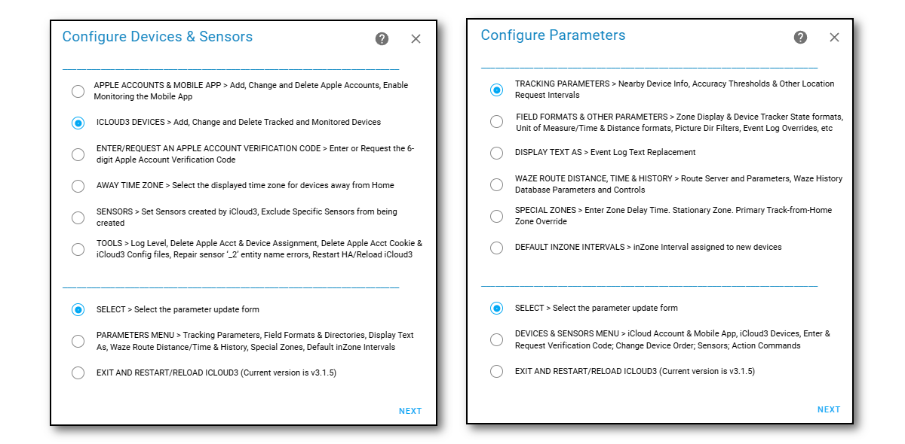
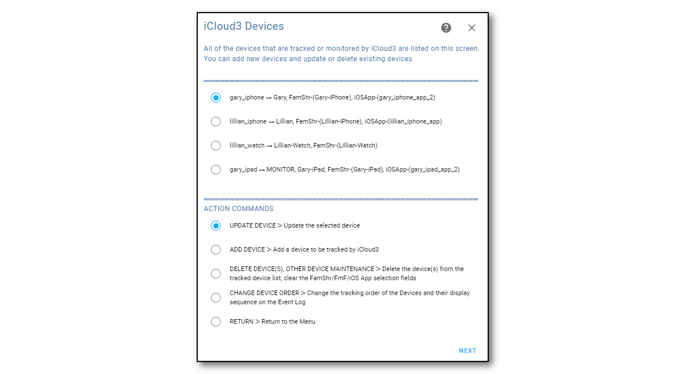
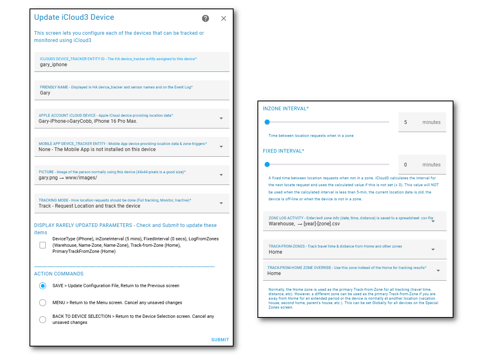
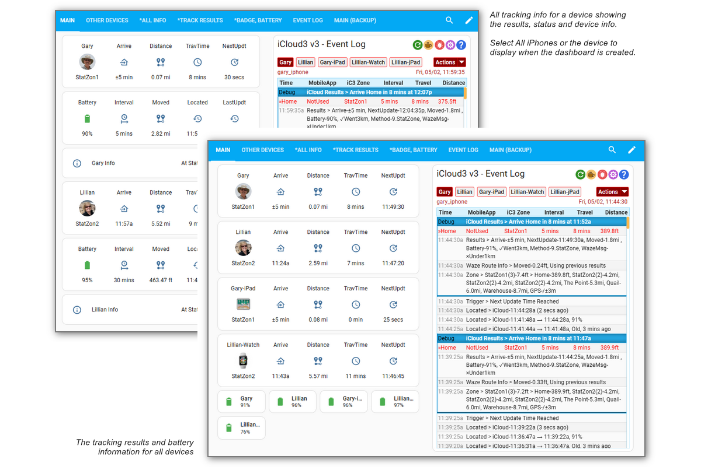
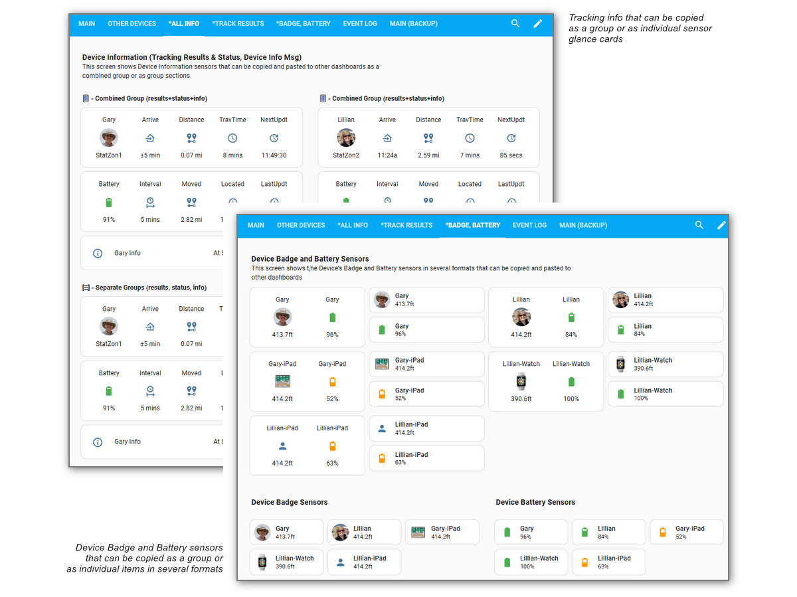
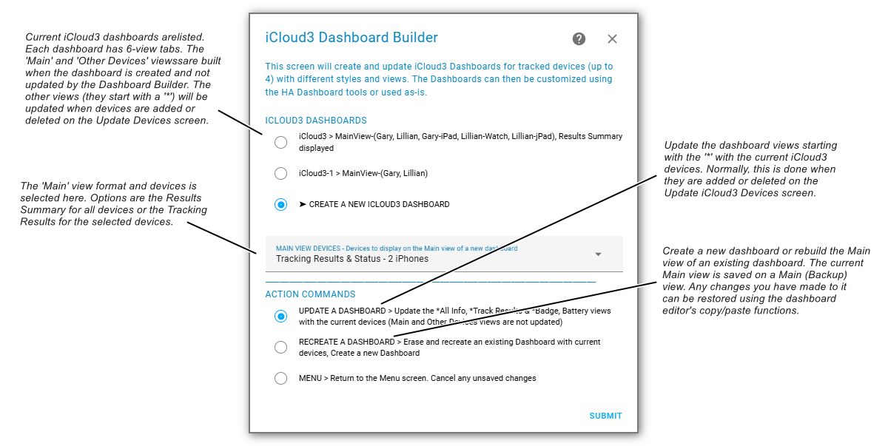
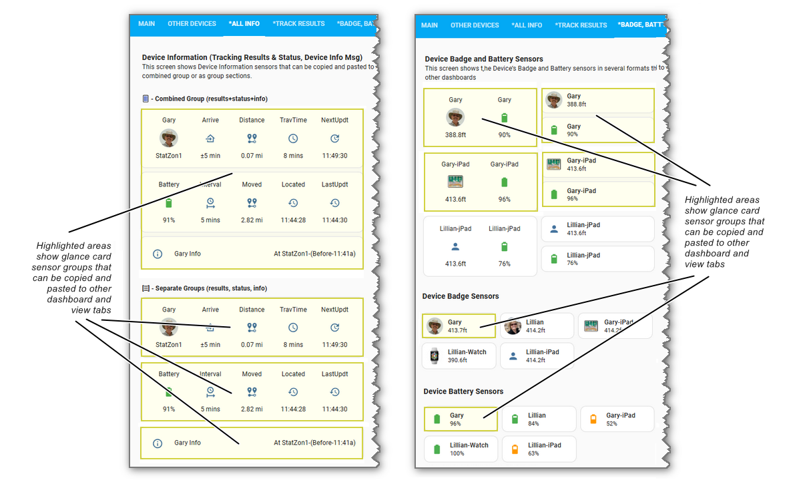
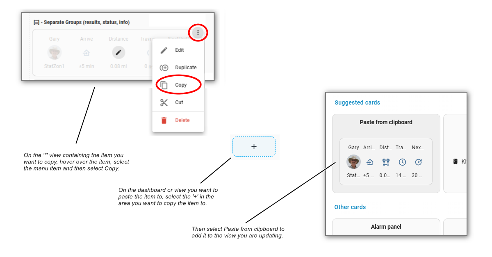

# iCloud3 Components   <!-- {docsify-ignore} -->

There are 4 major parts to the iCloud3 custom component that are used to configure, track and report device location information. They are:

- **iCloud3 Device Tracker** - This monitors the device's location, determines when the device should be located next and updates all the sensors
- **Event Log** - Shows a devices location, how the location changes, the results of location updates, errors, and startup information
- **Configure Settings** - Set up all the iCloud3 tracked devices, Apple Accounts, sensors and other parameters
- **Dashboard Builder** - Create iCloud3 dashboards with tracking results, battery information and the Event Log in several formats. The dashboards can then be customized with the Home Assistant Dashboard Editor and the various items and views can be copied and pasted into other dashboards. The Dashboard Builder is one of the *Configure Settings* screens. 

------

## iCloud3 Device Tracker

The iCloud3 Custom Component provides the core device tracking service. It does the following:
  - Initializes and sets up all tracking activities for the Devices using location data from iCloud Location Services or the Mobile App device_tracker entity (or both).

  - Monitors the Mobile App device_tracker entity for location changes, zone enter/exit triggers and battery information.

  - Requests and processes location data from iCloud Location Services and the Mobile App.

  - Analyzes the location data and tracks the devices.

  - Updates the sensors associated with each device.

    

The screens below show examples of a tracked device's current status. The following is displayed:

- Gary, on the left, is at Home. Lillian, on the Right is Away.
  - Arrive item - The icons and text show Gary is at Home (Home icon in a circle and he arrived home at @3:22p. Lillian is traveling towards home. Notice the distance, travel time and travel direction from the Home Zone. 
- Notice when the device was last located by iCloud or the Mobile App, when it was last updated by iCloud3 and the time of the next update. 
- Gary is tracking from Home and the Quail Zone, Lillian just from Home.
- The *Info* field shows tracking results from nearby devices is being used.

> The Lovelace code for these screens is in [Step #5 - Set up a Lovelace card tracking card](.../2.0-installing-and-configuring?id=step-6-set-up-a-lovelace-card-tracking-card) 

------

## Event Log

The Event Log is a Lovelace custom card that shows past and current activity related to tracking a device. This includes:

- Startup configuration.
- Device information for Apple account and Mobile App devices and entities
- Tracking results including zone, travel time and distance data
- Error messages, problems and location data issues
- Detail tracking monitors that show what is going on under the covers, how location data from the iCloud Location Services and the Mobile App is analyzed and processed

#### Actions command

The *Actions* command on the Event Log is used to control iCloud3 operations. This includes:
- Restart iCloud3 without restarting Home Assistant
- Pause and resume tracking
- Relocate all devices or a specific device
- Issue a *Find My Device* alert
- Export the Event Log to a text file
- Show/hide tracking monitors
- Set the Log Level (info, debug, rawdata) indicating the type of data to write to the *icloud3.log* file
- Run Waze History Database maintenance functions

Note: The Event Log is installed into the *config/www/icloud3* directory. This directory can be changed on the *Configure > Parameters Menu > Field Formats and Event Log Overrides* screen but there is really no need to do that.

Quick Link Icons

The icons above the *Actions* command menu list in the top-right are used for various iCloud3 activities.

| Icon                                                      | Description                                                  |
| --------------------------------------------------------- | ------------------------------------------------------------ |
|  | **Refresh** - This updates the Event Log screen with new activity for the selected device. |
|                      | **Buy Me a Coffee** - You find iCloud3 useful, appreciate the work I have done and want to send me a few dollars, euros, pesos, pounds, etc. Thanks. I appreciate it. |
|                      | **GitHub Issue** - You are having a problem and think you may have found a bug or other problem. This takes you to the iCloud3 GitHub Issues page to create a new issue or to review existing issues. |
|                      | **Configure** - This is a shortcut to the *HA Settings > Integrations > iCloud3* screen. Select *Configure* to display the various configuration screens. |
|                        | **User Manual** - This opens the iCloud3 User Manual.        |

------

## Configure Settings

The iCloud3 configuration screens are used to:
- Add and update Apple accounts
- Add and update tracked and monitored devices. You can assign the Apple account device and Mobile App device that provides location and other data, zone and tracking parameters, a picture or icon, etc
- Select the sensors to be updated during tracking operations
- Create HA Dashboards with iCloud3 sensors showing tracking results and battery information in several formats.
- Run special Tools to fix configuration problems
- Configure other tracking and formatting parameters
- Set up Special Zones and specify how Waze Route Tracking should be configured

#### Open the Configuration screens

There are two ways to open the Configuration Screens. 

- Select the    **Configure Icon** shortcut on the *Event Log screen* 
   Then select **Configure** 
   *or*   
-  Select from the HA Dashboard using **☰ > HA Settings > Devices & Services > Integrations > iCloud3** screen
   Then select **Configure**

> The Configure Icon shortcut is not available when you first install the iCloud3 integration. It will be available after the Event Log card has been setupit.

The *Configure Devices & Sensors* menu is displayed when you select *Configure*. Toggle between the two menus by selecting it from the Action list at the bottom of the screen.

#### Configure Devices & Sensors Menu screen

- Setup, update and log into the Apple Accounts containing the devices you want to track.
- Enable the Mobile App for monitoring location changes and zone enter.exit triggers.
- Setup and update iCloud3 tracked devices
- Select the sensors that report device and tracking results
- Enter the 6-digit verification code or request a new one to authenticate access to the Apple account
- Select how a sensor's time value and the time values in the Event Log should be displayed If you are away from home and in another time zone. You can show show the local time or the time of your HA server.
- Various utility tools for resetting configuration parameters, resetting and cleaning up bad data and other miscellaneous actions used for solving problems

#### Configure Parameters Menu screen

- Setup various tracking parameters dealing with time, accuracy, distances, etc.
- Setup how data should be formatted on the sensors and Event Log
- Change the text strings should be shown on the Event log
- Setup Waze Route information and Waze Route History
- Setup sensors changes when entering non-monitored zones, stationary zones that can be used when in a non-zone location for an extended period of time and using a pseudo home zone when away from home
- Setup default inZone time intervals 

#### Selection and Parameter Update screens

Select the parameter or other screen you want to view from the screen list on the menus.

1. Select the **Screen Name** from the option list at the top of the menu screen
2. Select **Select** from the option list at the bottom part of the menu screen
3. Select **Next**

> Select the Menu screen at the bottom to toggle between the menus

The screen you selected will be displayed It generally has two parts:

- **Top Part - Item Selection or Parameter Entry** - This is used to select a task to be done, select an Apple account or Device to be updated, select an item from a list and entering and configuring parameters, etc
- **Bottom Part - Command or Action to be done** - First select the desired option (Select/Next/Add/Update/Delete/etc.), then select the command i(Submit/Next/Last) in the bottom right-hand corner. Some screens will launch other screens for additional parameters, action confirmation, menu options, etc.

These example screens show these 2-sections. 

------

## Dashboard Builder

The Dashboard Builder is a tool that will create and update dashboards showing iCloud3 tracking results and other device information provided by iCloud3. It is added to the HA Sidebar panel when it is created and can be edited using the HA Dashboard Editor in the same manner as other dashboards. It's name starts with *iCloud3-#* and can be changed to meet your needs. There is no limit to the number of iCloud3 dashboards that can be created.

!> When the iCloud3 Integration is install the first time, the *iCloud3* is created and added to the HA Sidebar panel.

!> When new devices are added on the *Update iCloud3 Devices* screen, they are added to all iCloud3 dashboards *All Info, *Track Results and *Badge, Battery view tabs.*

Each dashboard has six view tabs. The *Main* and *Other Devices* view tabs are built for the selected devices when the dashboard is created. The other view tabs (their name starts with a '*') are recreated for all devices whenever a dashboard is updated. The type of elements that are created are:

- All tracking information (tracking results sensors + tracking status sensors  + device information sensors) as one item
- All tracking information (tracking results sensors, tracking status sensors, device information sensors) as separate items
- Device Badge sensors and Battery sensor as one item in several formats
- Device Battery sensors in several formats

#### Dashboard View Tabs

The six views tabs that are set up when a dashboard is created.

- **Main** - The main view for iCloud3 that shows the Event log and devices in several formats.
- **Other Devices** - Tracking info for the devices not on the Main view tab (not shown).
- ***All Info** - Tracking info for all devices where the three sensor glance cards can be copied as a group or individually to other dashboards .
- ***Track Results** - The Tracking info consists of three sensor glance cards - Tracking Results, Tracking status, Device Info Msg. This screen shows the Tracking Results Summary for all devices.
- ***Badge, Battery** - Device Badge and Battery sensors that can be copied as a group or individually to other dashboards .
- **Event Log** - The iCloud3 Event Log (not shown).
- **Main (Backup)** - The Main view tab is not updated when devices are added or deleted. You can customize it to meet your needs and show the sensors that are important to you. You can, however, recreate an existing dashboard which will erase any changes you have made. This screen is the main view tab before it was recreated. Items you really wanted to keep can be copied back to the new Main view tab. (not shown).

#### Creating a Dashboard

A dashboard is created on the *iCloud3 Dashboard Builder* screen. This can be found on the *iCloud3 Devices & Sensors* menu on the *iCloud3 Configure Settings* screen accessed uging the *Event Log > Configure Shortcut* or the *HA Settings > Devices & services > iCloud3* screen.

1. Select **Dashboard Builder** on the *iCloud3 Devices & Sensors* menu.
2. Select **Create a new iCloud3 Dashboard**.
3. Select **Update a Dashboard**.
4. Select **SUBMIT**.

The dashboard that is created is named *iCloud3-0, iCloud3-1*, etc. This name can be changed on the *HA Settings > Dashboard* screen.

#### Update an Existing Dashboard

When a dashboard is updated, the current iCloud3 devices are used to recreate the *All Info , *Track Results and *Badge, Battery view tabs. The *Main* and *Other Device*s view tabs are not changed. This lets you customize the Main view tab to show sensors, device trackers, and other cards to meet your needs.

1. Select the **iCloud3 Dashboard** to be updated
2. Select **Update a Dashboard**
3. Select **SUBMIT**

> The *Main* and *Other Devices* will be recreated when you select *Recreate a Dashboard*. The current *Main* view tab is saved to the *Main (Backup)* view tab.

#### Customizing the Main view tab or a dashboard not created with the Dashboard Builder

The *All Info, *Track Results and *Badge, Battery view tabs provide selectable elements that can be copied and pasted to another view tab or dashboard using the HA Dashboard Editor screens. That process is beyond the scope of this paragraph. HA provides instructions and tutorials here: https://www.home-assistant.io/dashboards/. 

The screens below show the typical elements that can be copied and pasted.

1. On the dashboard screen, select the **Edit Pencil** to open up the HA Dashboard Editor.
2. Go to the view tab with the item you want to copy to another dashboard or view tab.
3. Hover over the **3-dot More** image in the upper-left corner of the item to be copied and select **Copy**.
4. Go to the dashboard or view tab you want to copy the item to. Select the **'+' image** in the the destination area.
5.  Select **Paste** copied item to paste it. Pasting it into a *Horizontal Stack* or *Vertical Stack* can help position the item in with other similar items.

#### Miscellaneous Notes 

- The dashboard name and icon can be changed on HA Settings > Dashboards screen.
- The *url_path* starts with *ic3db* for dashboards created by the iCloud3 Dashboard Builder. You will not normally see this field.
