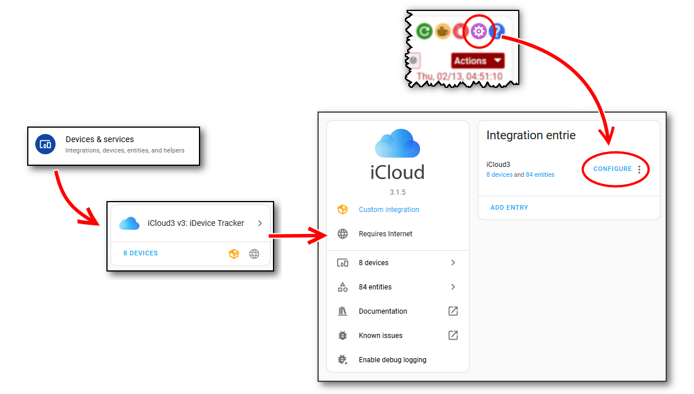

## 1.3  iCloud3 Configure Settings

*The Configure Settings* screens are used to configure iCloud3 parameters and are opened from:

- The *Configuration Icon*  on the **Event Log screen**.
- **☰ > HA Settings > Devices & Services > Integrations** screen or from the Gear icon on the Event Log screen. 

The *Configure Settings* consists of 2 menus and 10+ parameter entry screens. Each screen has two parts:

- **Selection or parameter entry (top part)** - This is used to select a task to be done, an item to be selected or an option list/text field for the parameter being configured.
- **Command or Action to be done (bottom part)** - First select the desired option (Select/Next/Add/Update/Delete/etc.), then select the command in the bottom right-hand corner of the screen (Next/Submit/Finish/etc.).

The example screens below show these 2-sections. These and the other screens are described in detail in the *Configuring iCloud3 Parameters* chapter.

#### 1.3.1 Update Configuration Main Menu screens

The menus are used to select the specific update screen.

#### 1.3.2 Update Tracked Device screens

Adding a new devices and updating an existing device is done on this screen.

#### 1.3.3 Format Settings screen

Configuring how information should be displayed in the device_tracker and sensor entities and on the Event Log screen. 

