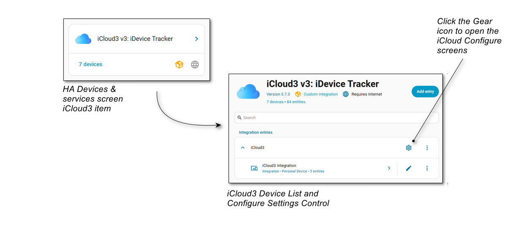
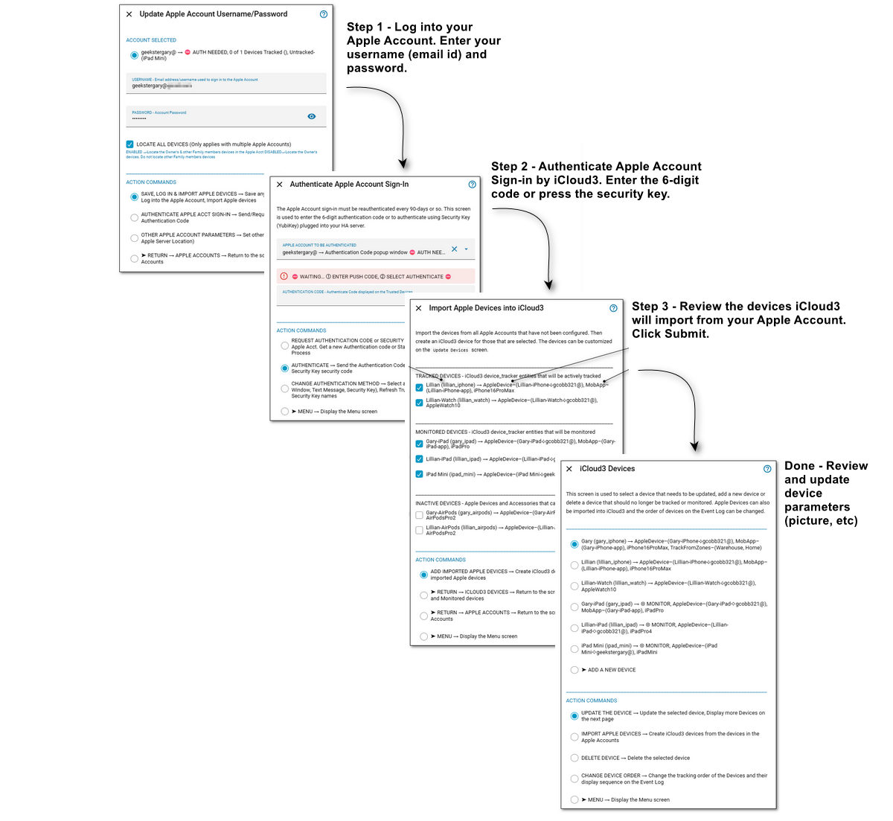

# How to Install iCloud3 and Configure it for the first time

There are several steps that that need to be done to install and start using iCloud3 to track your devices. They are:

1. Install the iCloud3 custom component integration:
   - Install iCloud3 from HACS (or add it manually)
   - Install and configure the HA Mobile App if you are using it on any of your tracked devices (optional
   - Add the iCloud3 custom component
2. Configure iCloud3:
   - Add your Apple account
   -  Authenticate access to your Apple account
   - Import the devices in your Apple account
   - Build the iCloud3 Dashboard

------

##  Installing iCloud3

iCloud3 is available on the HACS and is installed using the same process as other HACS custom components.

- **Using HACS to install iCloud3**
  1. Open HACS.
  2. Select **Integrations**, type **icloud3** in the search bar.
  3. Select the **iCloud3, iDevice Tracker** item, then select **+Download** to download iCloud3 and follow the normal steps for installing an integration using HACS.

- **Manual Installation from the iCloud3 Repository Releases Page**
  1. Download the *icloud3 v3.x.x.zip* file from the *gcobb321/icloud3 iCloud3 GitHub Repository Releases* page [here](https://github.com/gcobb321/icloud3/releases). Selects *Assets* at the bottom, then the zip file. The file save screen is displayed, select the location on your computer and save the zip file.
  2. Unzip the file into the *config/custom_components/icloud3* directory on your Home Assistant server (ex.: Raspberry Pi)
  3. Restart Home Assistant

------

## Installing iCloud3 Development Version (Beta)

New features are added to iCloud3 Development Version before they are released to the General Availability version on HACS. This Beta version can be added to HACS as a Custom Repository. Follow the instructions below:

- **Adding the iCloud3 Development Edition to HACS**

  1. Open HACS
  2. Select the 3-dots in the upper-right corner, then select *Custom Repositories*.
  3. Enter the following values in the fields displayed:
     - Repository: `gcobb321/icloud3_v3`
     - Category: `Integration`
  4. Select **Add**

  

  *Notes*:

  1. Additional information in the HACS User Guide can be found [here](https://www.hacs.xyz/docs/faq/custom_repositories/?h=reposit).

  2. Monitor the gcobb321/icloud3_v3 Issues page for an announcement that a new release is available.

  3. Download the *icloud3.v3.x.x.zip* file from the *gcobb321/icloud3_v3 iCloud3 GitHub Repository Releases* page [here](https://github.com/gcobb321/icloud3_v3/releases). Follow the Manual instructions above. 

------
## Add the iCloud3 Integration

iCloud3 is a Home Assistant Integration and is configured on the Integrations screens like all the other Integrations you may be using.

1. Select **☰ > HA Settings > Devices & Services > Integrations**.
2. Select **+ Add Integration** in the lower-right hand corner.
3. Type **iCloud3**. Then select **iCloud3** from the list of Integrations. The iCloud3 entry will be added to the *Integrations* screen.
4. Open the *iCloud3 Configure screen* as depicted below.
   - You have installed it for the first time:
     - Select **☰ > HA  Settings > Devices & Services > Integrations  > iCloud3  > Configure Gear Icon**.
   - You have installed it before and the Event Log has been set up:
     - Select the **Event Log > Purple Configure Gear Icon  > Configure Gear Icon**.

-----
## Configure iCloud3 for the First Time

Generally, when you click the Gear icon in the above image to open the iCloud3 Configure screens, the following will happen:

- The screen for adding your Apple Account is displayed. You enter your username/email-id and password and iCloud3 logs into your account.
- The authentication process starts the 6-digit code or security key keypress is requested and the *Authenticate Apple Sign-in* screen is displayed. You enter the code or press the security key.
- The devices in your Apple account are imported and iCloud3 device_tracker and sensor entities are created.
- The list of the created devices is displayed for your review and/or updating.
- You end the *iCloud3 Configure Session* and the *iCloud3 Dashboard* is created and added to the *HA Sidebar*.
- That's it, you are done! Each of these steps is described in detail below.

### Add your Apple Account

 Since you are doing this for the first time, the iCloud3 configuration file (*.storage/icloud3/configuration*) will be created with default values. The *Update Apple Account* screen is displayed.

- Enter your Apple account **username** (email id) and **password**.
- Click **Submit**

The username and password will be validated, iCloud3 will log into your Apple account and download the devices in your account. 

Note:

- *Locate All Devices* is enabled - All of the devices in your Family List will downloaded. 
- *Locate All Devices* is disabled - Only your devices are downloaded. 

If Apple logged into your account, the *Authenticate Apple Account Sign-in* screen is displayed.

### Authenticate Apple Account Sign-in

The next step is to authenticate iCloud3 access to your Apple account. This is done by entering the 6-digit 2fa code that will be sent to your iPhone or, if you are using a Security Key, inserting it into your HA Server and pressing it's button.

Three-methods of authentication are supported:

- **Push notification pop-up window** (default) - The *Apple Sign-in Requested* message is displayed on your Trusted Device (iPhone/iPad/Mac). This is followed by the popup window with the your location and *Don't Allow/Allow* buttons, followed by the *Apple ID Verification Code* window with the 6-digit code.
- **Text message** - The code is sent to a Trusted Phone in a text message.
- **Security key (YubiKey)** - You have configured your Apple account to use a security key. The security key is insert into the computer running HA (Mac, RPi, HA Green, etc). 

Do one of the following:

- **Push notification pop-up window**:

  - Select *Authenticate* if it not selected.

  - On the Trusted Device, touch **Allow** to display the 6-digit code. 

  - Enter the 6-digit code into the **Authentication Code** field, then click **Submit**.

- **Using a Security Key (Yubikey)** :
  - Select *Authenticate* if it not selected.
  - **Touch the Security key** inserted into your HA Server, then click **Submit**. 
  - The Security Key should be blinking. If it is not blinking, select *Request Authentication*, then click Submit to restart the process.

The code will be sent to Apple and verified. 

**Change Authentication Method** - The authentication method that is being used is displayed in *Apple Account to be Authenticated* field. If you want to change it, select the *Change Authentication Method* Action Command, then click Submit. Select the new method on the screen that is displayed, then click Submit to return to this screen. Select *Request Authentication Code* to restart the authentication process, then click Submit to request a new code or reinitialize the security key Then follow the steps above.

If Apple accepts the code, the *Import Apple Devices* screen will be displayed.

### Importing Apple Devices

The next step is to create the iCloud3 device_tracker and sensor entities from your Apple account devices that was downloaded earlier. 

The devices are grouped into three categories, the *Tracking Mode*:

- **Tracked Devices (iPhone, Watch)** - iCloud3 issues location requests to Apple when they are needed. The location, battery and other information is updated.
- **Monitored Devices (iPad, Mac)** - These devices are updated using data Apple provides when the Tracked are located.
- **Inactive Devices (AirPods, other Apple devices)** - Apple does not provide any location or battery information for these devices. 

​	 Note: You can change the *Tracking Mode* for a device later on the *iCloud3 Devices > Update Device* screen.

- Click Submit to create the iCloud3 device_tracker and sensor entities for the checked items.

The *iCloud3 Devices* screen is displayed showing the iCloud3 devices you just created.

### Review the iCloud3 Devices

This screen lists all of the devices that iCloud3 will Track and Monitor. Devices can be updated, added and deleted from this screen. 

- If you want to review or change the device's individual fields (it's picture for example):

  - Select the device

  - Select *Update the Device* Action Command, then click **Submit**.

  - The *Update Device* screen is displayed. See [here](../#/chapters/3_devices?id=add-and-update-an-icloud3-device) for more information about this screen.

You have completed all of the steps needed to configure iCloud3. 

To end the iCloud3 Configure Session and display the *HA Devices & services* screen.
- Select **Menu**, then click **Submit** to display to the Configure and *Devices and Sensor*s menu.
- Select **Exit**, then click **Submit** to end the *iCloud3 Configure Session*. 

### iCloud3 Dashboard

When you end the *iCloud3 Configure Session*:

- The iCloud3 Dashboard is created and added to the *HA Sidebar* with a *Cloud* icon (). A sample screen is shown below..
- The devices you added are located.
- The device_tracker and sensor entities are updated. 

- Click the *Cloud* icon on the HA Sidebar to display the iCloud3 Dashboard screen.

  

That's it. Congratulations! You have installed iCloud3 and are tracking your devices. 

When you can, review the rest of the documentation. You may find other features you can use. Things like:

- Opening your garage door when you get home or closing it when you leave.
- Checking to make sure your doors are all locked when no one is home.
- Tracking the location of service vehicles.
- Monitoring your irrigation zones so your automated mower does not mow one that is still wet.
- Getting notified when your spouse or children are nearing home or leaving school or the gym.
- Getting notified when the battery level of your iPad is low or when it has been fully charged.
- Logging when you enter and exit a zone to a .csv spreadsheet file that can be used for filing expense reports.

Thanks and good luck!

*And if you like iCloud3, maybe you could get me a cup of coffee*

-----
*Gary Cobb, aka GeeksterGary*

