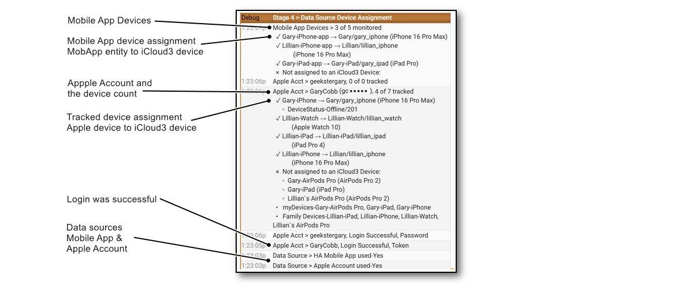

# Using HA Companion Mobile App  for Location Data<!-- {docsify-ignore} -->

iCloud3 monitors the Mobile App device_tracker entity and several sensors for:

- zone enter/exit triggers
- location changes
- battery level updates. 

The sensors are monitored for changed data every 5-seconds. iCloud3 also sends messages to the Mobile App when an error occurs and when a location update from the Mobile App is needed.

The Mobile App consists of two components:

- **Home Assistant Companion App [(HA Docs here⧉ )](https://companion.home-assistant.io/)**  - This is installed from the Apple App store [here⧉ ](https://apps.apple.com/us/app/home-assistant/id1099568401) on every iPhone and iPad you want to monitor. 
- **Mobile App integration [(HA Docs here⧉)](https://www.home-assistant.io/integrations/mobile_app/)**. - This is added like all integrations on the _Settings > Devices & services > Integration_ screen. It connects to the Home Assistant App on the iPhone or iPad and updates device_tracker and sensor entities for the  zone, battery, location and other data from the  App.

## Configure the Home Assistant Companion App

- **Device Name** - This is the name the Mobile App Integration will use for the device_tracker entity (*device_tracker.gary_iphone_app*) and sensors (*sensor.gary_iphone_app_battery_level*). 

  Tip: When the HA App is first installed, it uses the name of the device on the *Settings App > General > About > Name* (*Gary_iPhone*) as the device name. That is fine but later on, you will need to create a different name for the iCloud3 device name (*i.e., gary_iphone_ic3)*. However, if you would rather have the iCloud3 device and sensors to start with actual name of the device (*gary_iphone*) instead of something else (*gary_iphone_ic3*), you need to change the HA Mobile App Device Name field. Below it was changed to *Gary_iPhone_app*.

- **Location Permissions** - The 3 screen images on the left show the configuration to share zone changes, location updates and other information.

The screens below shows the configuration settings App. This is done on the device.

------
### Results of not installing the Mobile App

iCloud3 does not require the Mobile App to be installed on an iPhone or iPad. However, if it is not installed, the following happens:

- iCloud3 will not react to a Zone Enter or Exit events until the phone's *Next Update Event* time. This will delay the device entering a zone or exiting from it.
- Significant location changes will not be available.
- The device's battery level is not available.
- Notifications can not be sent to the device.
- In this case, a short *inZone Interval* will help reduce the time between location updates.

The documentation for the Home Assistant Companion can be found [here](https://companion.home-assistant.io/). It is very extensive and explains how to set it up and use it.  ay particular attention to:
- Setting it up [here](https://companion.home-assistant.io/docs/getting_started/)

- Location [here](https://companion.home-assistant.io/docs/core/location)

- Sensors [here](https://companion.home-assistant.io/docs/core/sensors)

- Notifications [here](https://companion.home-assistant.io/docs/noticationsnotifications-basic)

  

------

## Apple Watch is not Located

Only iPhones and iPads with the Mobile App installed are monitored. Although there is an HA Complication that can be installed on the Apple Watch, it does not provide location information so it is not monitored. iCloud3 attempts to trigger zone exits by requesting an Apple Account location update when a nearby iPhone or iPad receives a zone exit trigger.

------

## Mobile App Devices discovered by iCloud3

When iCloud3 starts, Stage 4 handles setting up the Apple Account and Mobile App devices. The following is done:

- Read all of the devices in the Mobile App integration
- Match them up with the iCloud3 device using the Mobile App device_tracker parameter from the *Update iCloud3 Device* screen
- Errors are identified. This includes missing device_tracker entities, duplicate devices, etc.

The results are shown in the *Event Log > Stage 4* screens. 

------
## Clearing the Mobile App Cache

The cache needs to be cleared when a new version of the Event Log is installed. This does not happen very often, usually when major iCloud3 version is released. A message, with instructions, is displayed when this is needed. It will need to be cleared on every device (iPhones, iPads) that is using the Mobile App. 

1. In the *Home Assistant Companion App*, tap **☰ > HA Settings > Companion App.**
2. Tap **Debugging > Reset front end cache**
3. Tap **Settings > Done**
4. Refresh the screen by pulling down on it until the refresh symbol displays. This will reload the screen and iCloud3 Event Log from the HA server.

