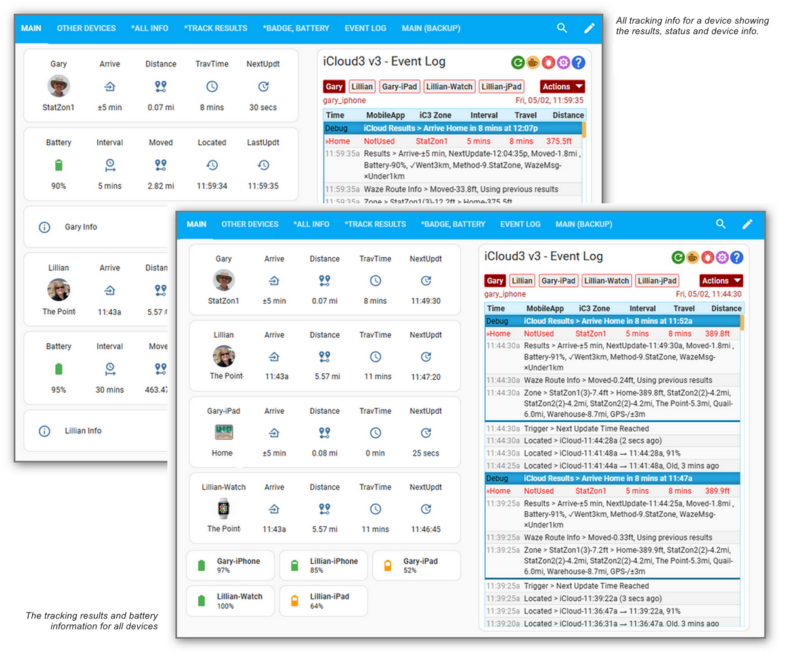

# iCloud3 v3 Device Tracker Custom Component

    

  

iCloud3 is a device tracker custom component that tracks your iPhones, iPads, Apple Watches, AirPods and other Apple devices. It requests location data from Apple's iCloud  Location Services and monitors various triggers sent from the Home Assistant Mobile App to Home Assistant. Sensors are updated with the device's location, distance from zones, travel time to zones, etc. 

## iCloud3 v3 Highlights

Although Home Assistant has it's own official iCloud component, iCloud3 goes far beyond it's capabilities. The important highlights include:

- **HA Integration** - iCloud3 is a Home Assistant custom integration that is set up and configured from the *HA Settings > Devices & Services > Integrations* screen.
- **Configuration Settings** - All of the parameters are updated on configuration screens selected from the *iCloud3 Integrations* entry.
- **Track devices from several sources** - Family members on the iCloud Account Family Sharing list and devices that have installed the HA Mobile App can be tracked.
- **Multiple Apple Accounts** - Devices from up to 10 Apple Accounts can be tracked.
- **Actively track a device** - The device will request it's location on a regular interval.
- **Passively monitor a device** - The device does not request it's location but is tracked when another tracked device requests theirs.
- **Waze Route Service** - The travel time and route distance to a tracked zone (Home) is provided by Waze.
- **Waze Route Service History Database** - The travel time and route distance received from Waze is saved to a local database to improve performance and eliminate the response delay due to poor cell service and slow internet speed. 
- **Track from Multiple Zones** - The device is always tracked from the Home Zone. Now it can also be tracked from another zone (office, second home, parents, etc.). Travel time and distance to the other zone is reported just like the Home zone. Additionally, another zone can act as the primary 'Home' zone (vacation home, parents home, etc). This can be configured by device or globally. 
- **Log Zone Activity** - Save zone enter/exit information to a .csv file for selected zones. This file can be imported into a spreadsheet program (Excel) and used for zone activity reports, Expense Reporting, zone usage monitoring, etc.
- **Local Time Zone Support** - Times can be displayed in the local time zone when you are in another time zone.
- **Improved GPS Accuracy** - GPS wandering errors leading to incorrect zone exits are eliminated.
- **Stationary Zone** - A dynamic *Stationary Zone* is created when the device has not moved for a while (doctors office, store, friend's house). This helps conserve battery life. This is then deleted when all devices have exited the zone.
- **Sensors and more sensors** - Many sensors are created and updated with distance, travel time, polling data, battery status, zone attributes, etc. You can customize the sensors that are created to meet your needs.
- **Event Log** - The Event Log is a custom Lovelace card and is an important component of iCloud3 that tells you what is going on. It shows how devices are configured, how iCloud3 starts and sets up your devices, location and tracking events, errors and alerts, nearby devices, debug information, etc.
- **Dashboard Builder** - The Dashboard Builder provides a convenient method of creating iCloud3 dashboards in several formats. Dashboard elements can be copied and pasted onto other dashboards or view tabs. The screens below were created with the Dashboard Builder. 
- **Detailed debugging information** - Several levels location history transactions can be displayed in the Event Log or in the iCloud3 Log File. These include general information, debug data and the raw device location data received from iCloud Location Services.
- **Updating and Restarting** - iCloud3 can be restarted without restarting Home Assistant. The current device_tracker and sensor entity states are restored on a restart.
- **Device_tracker and sensor entities** - iCloud3 devices and sensors are true Home Assistant entities that are configured with the iCloud3 Configure screens.
- **Nearby Devices** - The location of all devices is monitored and the distance between devices is determined. Information from devices close to each other is shared.
- **And More** - Review the following documentation to see if it will help you track and monitor the locations of your family members and friends.

## Information screens showing tracking information

The screens below are an example of how the many tracking sensors can be displayed. The screen on the left shows the current tracking formation for Gary while the Event Log on the right shows a history of important tracking events.

## iCloud3 Documentation

- Introduces the many features and components of iCloud3
- Provides step-by-step instructions to install and configure iCloud3, it's components and it's supporting components (iCloud Account and the Mobile App)
- Highlights the configuration screens and parameters
- Provides example screens, automations and scripts

  

## Installing iCloud3

iCloud3 can be installed two ways:

- Using HACS
- Downloading the *icloud3.zip* file from the *iCloud3 GitHub Repository Releases Page* [here](https://github.com/gcobb321/icloud3_v3/releases). 

The procedures for both methods are described in the *Installing and Configuring iCloud3* chapter [here](chapters/2.0-installing-and-configuring.md).

## iCloud3 Components

There are 4 major parts to the iCloud3 custom component that are used to configure, track and report device location information. They are:

- **iCloud3 Device Tracker** - This monitors the device's location, determines when the device should be located next and updates all the sensors
- **Event Log** - Shows a devices location, how the location changes, the results of location updates, errors, and startup information
- **Configure Settings** - Set up all the iCloud3 tracked devices, Apple Accounts, sensors and other parameters
- **Dashboard Builder** - Create iCloud3 dashboards with tracking results, battery information and the Event Log in several formats. The dashboards can then be customized with the Home Assistant Dashboard Editor and the various items and views can be copied and pasted into other dashboards. The Dashboard Builder is one of the *Configure Settings* screens. 

### iCloud3 Device Tracker

The iCloud3 Custom Component provides the core device tracking service. It does the following:

  - Initializes and sets up all tracking activities for the Devices using location data from iCloud Location Services or the Mobile App device_tracker entity (or both).

  - Monitors the Mobile App device_tracker entity for location changes, zone enter/exit triggers and battery information.

  - Requests and processes location data from iCloud Location Services and the Mobile App.

  - Analyzes the location data and tracks the devices.

  - Updates the sensors associated with each device.

    

The screens below show examples of a tracked device's current status. The following is displayed:

- Gary, on the left, is at Home. Lillian, on the Right is Away.
  - Arrive item - The icons and text show Gary is at Home (Home icon in a circle and he arrived home at @3:22p. Lillian is traveling towards home. Notice the distance, travel time and travel direction from the Home Zone. 
- Notice when the device was last located by iCloud or the Mobile App, when it was last updated by iCloud3 and the time of the next update. 
- Gary is tracking from Home and the Quail Zone, Lillian just from Home.
- The *Info* field shows tracking results from nearby devices is being used.

### Event Log

The Event Log is a Lovelace custom card that shows past and current activity related to tracking a device. The right side of the *Information screen showing Tracking Information* above is the *Event Log*. The *Event Log* shows:

- Startup configuration.
- Device information for Apple account and Mobile App devices and entities
- Tracking results including zone, travel time and distance data
- Error messages, problems and location data issues
- Detail tracking monitors that show what is going on under the covers, how location data from the iCloud Location Services and the Mobile App is analyzed and processed

### Configure Settings

The iCloud3 configuration screens are used to:

- Add and update Apple accounts
- Add and update tracked and monitored devices. You can assign the Apple account device and Mobile App device that provides location and other data, zone and tracking parameters, a picture or icon, etc
- Select the sensors to be updated during tracking operations
- Create HA Dashboards with iCloud3 sensors showing tracking results and battery information in several formats.
- Run special Tools to fix configuration problems
- Configure other tracking and formatting parameters
- Set up Special Zones and specify how Waze Route Tracking should be configured

### Dashboard Builder

The Dashboard Builder is a tool that will create and update dashboards showing iCloud3 tracking results and other device information provided by iCloud3. It is added to the HA Sidebar panel when it is created and can be edited using the HA Dashboard Editor in the same manner as other dashboards. It's name starts with *iCloud3-#* and can be changed to meet your needs. There is no limit to the number of iCloud3 dashboards that can be created.

!> When the iCloud3 Integration is install the first time, the *iCloud3* is created and added to the HA Sidebar panel.

!> When new devices are added on the *Update iCloud3 Devices* screen, they are added to all iCloud3 dashboards *All Info, *Track Results and *Badge, Battery view tabs.*

Each dashboard has six view tabs. The *Main* and *Other Devices* view tabs are built for the selected devices when the dashboard is created. The other view tabs (their name starts with a '*') are recreated for all devices whenever a dashboard is updated. The type of elements that are created are:

- All tracking information (tracking results sensors + tracking status sensors  + device information sensors) as one item
- All tracking information (tracking results sensors, tracking status sensors, device information sensors) as separate items
- Device Badge sensors and Battery sensor as one item in several formats
- Device Battery sensors in several formats
