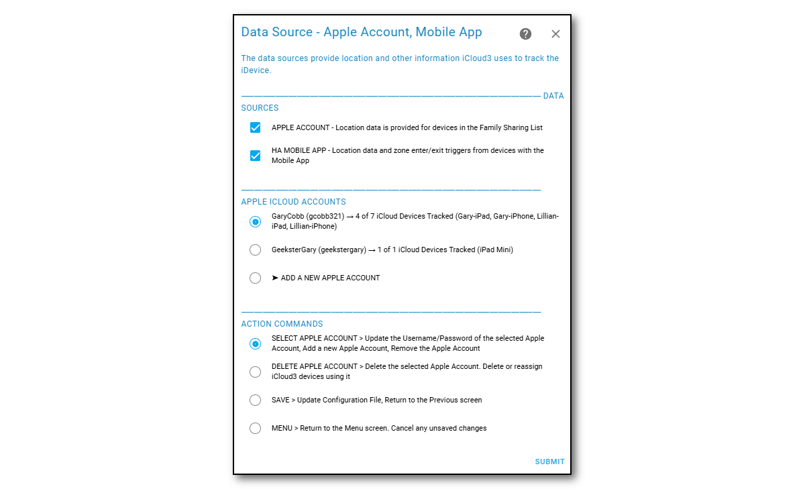

## iCloud Account Family Sharing (FamShr) Devices  <!-- {docsify-ignore} -->

The iCloud Account is the primary source of location data. It provides information related to the iPhones, iPads, Watches  and other devices in the Family Sharing list to iCloud3 devices that are tracked or monitored.

> In China, different URLs are used to access the iCloud servers. An option is available on the *iCloud Account* screen.

The iCloud Account is logged into when iCloud3 starts. Apple returns authentication/verification data that is stored in  on the HA server in the *config/.storage/icloud* directory. These *cookie* and *session* files store tokens that are used to access your iCloud account without requesting a 6-digit verification code every time you start iCloud3 or request location data. This is described in detail in *2.3 iCloud Account Access and Authentication* HERE.

------

### Configuring the iCloud Account as a Data Source

The Apple Account username (email_id) and password is needed to access the iCloud account. This is set up on the *iCloud Account & iOS App* screen in the iCloud Account section at the top of the screen.

To enable Family Sharing data usage:
1. Check the **Family Sharing List members ...** to set enable the iCloud Account as a location data source.
2. Enter the *Apple ID (Username)* and *Password* for your iCloud account. Click the **Display Icon** at the end of the username and password fields to display their values. 
3. Select **Login**, then select **Submit**.  The iCloud account will be logged into and the lists of iPhones, iPads and other devices associated with the account will be set up. 
   - Note: If the account is being setup and logged into for the first time, you will receive a notification on a trusted device (iPhone or iPad) that someone is logging into your iCloud account. Generally, you will allow access and the 6-digit verification code is displayed. The *Apple ID Verification Code* screen is displayed, you enter the code and send it back to Apple. This screen is redisplayed if the code is accepted. Otherwise, error messages are displayed and you will need to enter the code again. See the *iCloud Account Access and Authentication* chapter HERE for more information.
4. If you were logged in successfully, select **Save** to save the new account username/password and **Submit** to return to the menu. 

*Notes:*

- The password is encrypted when it is saved in the configuration file.
- When iCloud3 starts, you are logged into your Apple iCloud account. The account username/password is shown on the *LOGIN Action* line (gc......@gm......./Gc......).

**China Users** - A different URL is used to access the iCloud Account servers in China (.cn is added to the URL). Enable this field if necessary.

#### Changing the iCloud Account

If you want to change to a new iCloud Account, change the username or change password:

1. Enter the new username and new password of the new iCloud Account.

2. Select **Login**, then select **Submit**. Do not select **Save** yet. Go through the verification process first.

   If the login is successful, the Family Sharing List devices are loaded for the new account. Be sure to review each device on the **Update Devices** screen and verify the Family Sharing device for the devices iCloud3 is tracking and monitoring is correct.

3. Select **Save** to save the new account username/password and **Submit** to return to the menu. 

------

### Assigning the Family Sharing Device

The Family Share device is assigned to an iCloud3 device on the *Update Tracked iCloud3 Devices* screen. 

1. Select the device to update on the *Devices List* screen.

2. Select the Family Sharing device to be assigned from the Family Sharing Devices list.

   

3. Select **Save** to save the change and **Submit** to return to the *Devices List* screen.

Notes:

- Select *None* if you are not using FamShr location dat for this device.

------

### Tracking an Apple Watch and AirTags

**Apple Watch** - The iOS App Complication can be installed on the Apple Watch, however:

- It does not provide location information.
- It will not receive notifications sent from iCloud3.
- Set the *iOS App device* to *None*
- Set the *inZone Interval* to 15-minutes to minimize the delay when the device enters or exits a zone.
- Only assign a *Family Sharing* device to the tracked Watch device.

**Apple AirTags** - These devices can not be tracked. They are not tracked by Apple like an iPhone or iPad and location information is not returned from iCloud Location Services for them.

------

### Upgrading to a new Device (Ex.: iPhone 13 to iPhone 14)

The FamShr device's name (*Gary iPhone*) selected from the above list is stored in the iCloud3 configuration file. This is used to determine the actual Apple device providing location data when iCloud3 starts.

Several events take place when you upgrade a device, i.e, replace an iPhone 13 Pro with an iPhone 14 Pro. 

- The apps, data and settings are transferred from the iPhone 13 Pro to the iPhone 14 Pro.
- In this example, the name is on the iPhone 13 Pro is *Gary iPhone*. 
- A new name is assigned to the iPhone 14 Pro, i.e, *Gary iPhone (2)*.
- The iPhone 14 is assigned a new *device_id* by Apple. This *device_id* is used internally by Apple and you never see it. It is used, however, by iCloud3 to identify the actual device providing location data.
- The iPhone 13 Pro is removed from the *FindMy App* and the Apple iCloud account and traded-in or sold.

At this time, iCloud3 is still tracking the *Gary iPhone/iPhone 13 Pro* that is no longer on your iCloud account instead of the new iPhone.

**Easy way** - The following steps should be done to make it easier to identify and transfer to the new iPhone:

- Rename the iPhone 13 Pro from *Gary iPhone* to *Gary iPhone 13*. 
- Rename the iPhone 14 Pro from *Gary iPhone 13 (2)* back to *Gary iPhone* after you transfer the apps, data and settings.
- Restart iCloud3.

Since the new iPhone 14 Pro is now the *Gary iPhone* device, it will be now be assigned to the same iCloud3 tracked device.

**Harder way** - You realize that *Gary iPhone* is no longer being tracked because the iPhone is no longer on your Apple iCloud account or it has been wiped and powered off. 

- Restart iCloud3. The Family Sharing list will be rebuilt with the current name.
  - Select the new iPhone from the Family Sharing list on the *Update Tracked iCloud3 Device* screen. 
  - Restart iCloud3 again. The new iPhone's name will be assigned to the iCloud3 tracked device.
- Or, 
  - Change the name on the iPhone 14 Pro from *Gary iPhone (2)* to *Gary iPhone*.
  - Wait a few minutes until this name is re-registered with the Apple account.
  - Restart iCloud3 to reassign the name to the iCloud3 tracked device.

The device type (iPhone 14 Pro) and Apple model number (iphone15,2) is shown on the device list to help identity the actual device.

