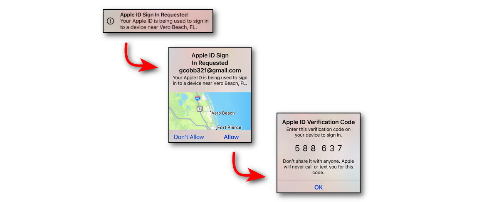
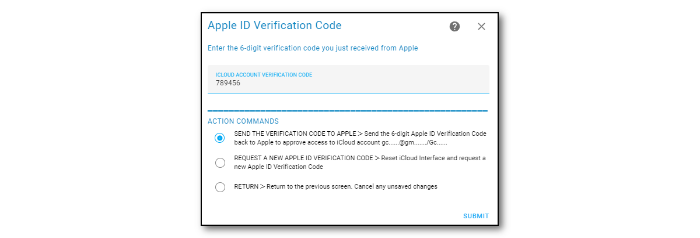
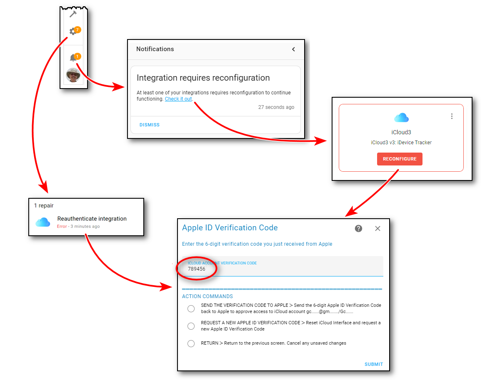
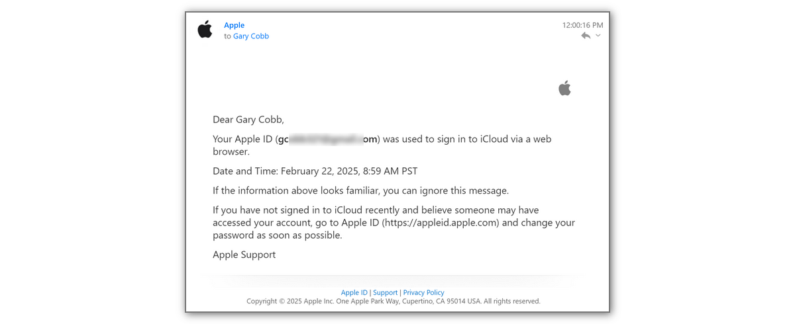

## Authenticating Apple iCloud Account Access <!-- {docsify-ignore} -->

------

### Apple Notification windows

iCloud3 will log into your Apple iCloud account to retrieve information related to the devices in your Family Sharing list to include:

- Device name, type, model and other identifying information, etc.
- Location data, gps accuracy, location time, etc.

When iCloud3 logs in the first time and about every 2-3 months after that, Apple will display the authentication screens on your iPhones, or iPads with the 6-digit verification code. 

The Apple ID Sign in Requested message is displayed on all of the devices that are configured as Trusted Devices. See [here](https://support.apple.com/en-us/HT205064) for additional information. If this popup window is repeatedly displayed, then Apple is not receiving the code properly or someone else with one of the Trusted Devices is responding before you do. In that case, Apple has sent the 6-digit code to that device and you will not receive it. You will need to request a new code on the Enter/Request Verification Code screen.

The *Event Log* screen also displays an alert that the Verification Code has been requested from Apple.

### Apple ID Verification Code

When you receive this notification, the 6-digit Apple ID Verification Code is entered on the *Configure Settings > Enter/Request Apple ID Verification Code* screen. 

- **Enter the 6-digit code**, Select **SEND THE VERIFICATION TO APPLE** and click **SUBMIT**. The code will be sent to Apple,  Apple will verify it and a message indicating it has been accepted is displayed on the screen. 

The 6-digit verification code you get on your iPhone or iPad is only valid for a limited time. If you do not reauthenticate iCloud3's access to your iCloud account within that time, the following error message is displayed:

​		`The Verification Code was not correct. Reenter or request a new code`

If you think the code is correct, reenter it and try again. If not request a new verification code and use the new code.

### Requesting a New Verification Code

Select **REQUEST A NEW APPLE ID VERIFICATION CODE** and click **SUBMIT**. The iCloud interface is reset and Apple will send the Apple ID Sign In screen and a new 6-digit Verification Code to your trusted devices.

You can also request a new code by selecting Reset iCloud Interface on *Event Log > Actions* or the *Configure Settings > Actions* screen.

There are several ways to display this screen:

- From the iCloud3 Configure Settings menu screen
- From the iCloud Account & iOS App screen
- From the* Home Assistant Notifications Bell on the Home Assistant dashboard (shown below)
- From the Home Assistant Devices & Settings screen 

  

  

### Access tokens, password and security

iCloud3 is always logged into your Apple account. When iCloud3 starts and logs into your iCloud account, Apple returns an *access token* indicating iCloud3 is authorized to use data from the iCloud account. These tokens expire after about 30-minutes and the login process using the access token is done again. After a while (determined by Apple), the token is invalidated and the Apple requests the password. A new access token is sent and the process starts over.

Note: The access token is stored as cookie files in the *config/.storage/icloud* and *config/.storage/icloud/session* directory. The file name is derived from the Apple ID (email address) of the iCloud account.

### Login email Notification from Apple

An email is sent from Apple when you log into your your iCloud account using your password. You will receive this email:

- When you are setting up iCloud3 and you login the first time
- Every time the password is used to log into your account. This may be several times or more during the day.

!> You will receive a number of these emails from Apple each day while iCloud3 is tracking your devices. The number you receive is determined by Apple, iCloud3 can not do anything about this.  iCloud3 minimizes the number you receive as best it can by using tokens first and only logging in when Apple requests one.

####  What can you do to minimize these emails from clogging up your inbox

The short answer is not much. 

I have set up a gmail filter that detects the email from Apple, marks it as read, bypasses the inbox and puts it in a special Apple email folder. Some have said they are concerned about someone hacking into their Apple account, they will not know about it and do not want to use these automatic filters. A valid concern but this works for me. I would welcome any other suggestions I might add to this User Guide to help others deal with this problem.
