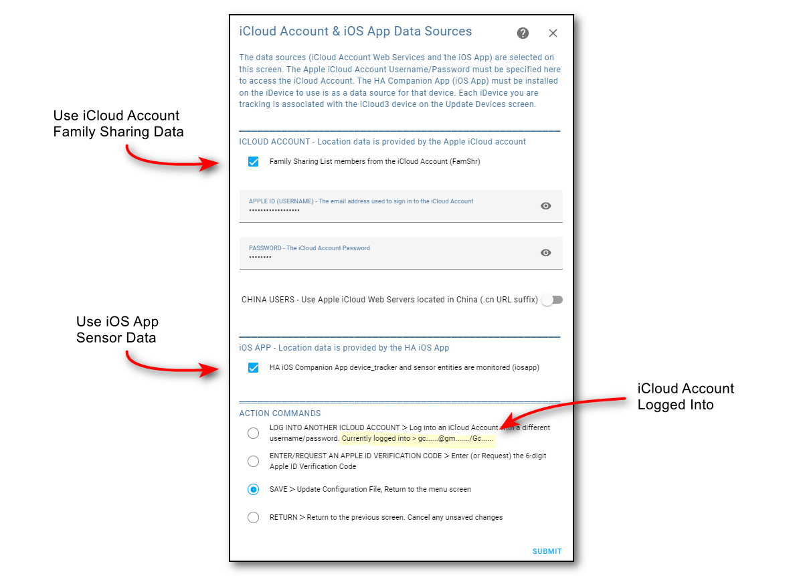
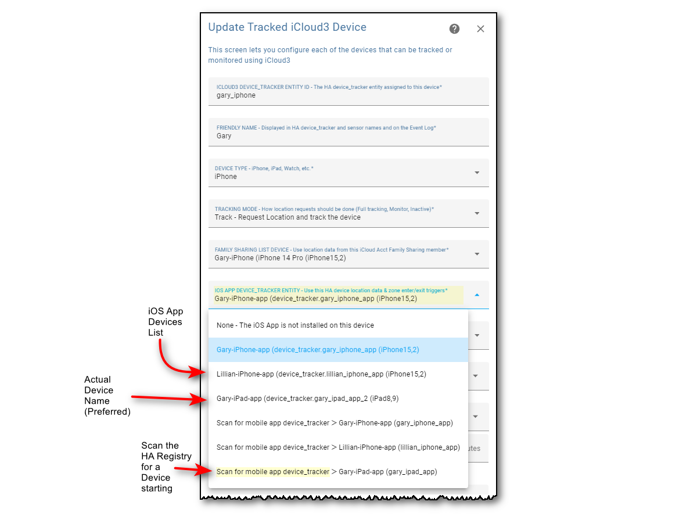

# HA Companion Mobile App (iOSApp) Devices  <!-- {docsify-ignore} -->

iCloud3 monitors the iOS App device_tracker entity and several sensors for zone enter/exit triggers, location changes and battery level updates. The sensors are monitored for changed data every 5-seconds. iCloud3 also sends messages to the iOS App when an error occurs and when a location update from the iOS App is needed.

*Notes*:

- iCloud3 does not require the iOS App to be installed on the iPhone or iPad. 

- The HA Complication for the Apple Watch does not provide location information. See below for more information about this.

------

### Configuring the iOS App as a Data Source

The HA entities that iCloud3 are monitors are:

- **device_tracker.[device_name]** - Location changes

- **sensor.[device_name]_last_update_trigge**r - Triggers indicating what caused the location change to include zone enter/exit, background refresh, manual, significant location change and others. This is described in more detail in the HA Companion App documentation.

- **sensor.[device_name]_battery_level** - The battery level for the device and if the device is charging or not charging. The battery level icon is used to identify it's charging status.

  

#### Enable HA iOS Companion App data usage

1. Check the **HA iOS Companion App ...** to set enable the iOS App as a location data source if the iOS App is installed on any device that will be tracked.

2. Select **Save** to save the changes and **Submit** to return to the menu. 

   

------

### Assigning the iOS App Device

The iOS App device is assigned to an iCloud3 device on the *Update Tracked iCloud3 Devices* screen. 

1. On the *Devices List* screen, select the **Device** to update, select **Update** and click **Submit**.

2. Select the iOS App device to be monitored from the iOS App Devices list.

3. Select **Save** to save the change and **Submit** to return to the *Devices List* screen.

Notes:

- Select *None* if the iOS App is not installed on this device.

- If the *Scan for mobile_app ...* is selected, the HA Registry will be scanned for iOS App device starting with the device name indicated. This is provided for v2-to-v3 migration purposes and is not generally recommended. 

  

#### If the iOS App is not Installed  <!-- {docsify-ignore} -->

iCloud3 does not require the iOS App to be installed on an iPhone or iPad. However, if it is not installed, the following happens:

- iCloud3 will not react to a Zone Enter or Exit events until the phone's *Next Update Event* time. This will delay the device entering a zone or exiting from it.
- Significant location changes will not be available.
- The device's battery level is not available.
- Notifications can not be sent to the device.
- In this case, a short *inZone Interval* will help reduce the time between location updates.

------

### Using the iOS App with the Apple Watch

Only iPhones and iPads with the iOS App installed are monitored. Although there is an HA Complication that can be installed on the Apple Watch, it does not provide location information so it is not monitored. iCloud3 attempts to trigger zone exits by requesting a FamShr location update when a nearby iPhone or iPad received a zone exit trigger.

------

### Event Log Family Share Information When iCloud3 Starts

When iCloud3 starts, the Event Log shows:
- The steps, results and errors when logging into the iCloud Account (Stage 4).
- The Family Sharing Devices that have been returned from the iCloud Account (Stage 4).
- The Family Sharing device assigned to the iCloud3 tracked device (Stage 5).

This information will help solve device or tracking problems, especially when a device has been upgraded or a new device is tracked.

------

### Install and Configure the iOS App

The iOS App is not required for iCloud3 to track devices. But it helps and it's benefits have already been discussed. It can be installed on some of your iDevices and not others. You can, for example, install it on your iPhone and not your wife's. 

The official documentation for the iOS App (Home Assistant Companion) can be found [here](https://companion.home-assistant.io/).  Select *Getting Started* for instructions on installing and configuring the iOS App.

The iOS App must be configured to provide location and zone activity to Home Assistant. The screen below shows the correct settings:

------

### Clearing the iOS App Cache

The cache needs to be cleared when a new version of the Event Log is installed. A message, with instructions, is displayed when this is needed. It will need to be cleared on every device (iPhones, iPads) that is using the iOS App. 

1. In the *Home Assistant Companion App*, tap **☰ > HA Settings > Companion App.**
2. Tap **Debugging > Reset front end cache**
3. Tap **Settings > Done**
4. Redisplay one of the Lovelace screens and pull it down to reload the screens.
