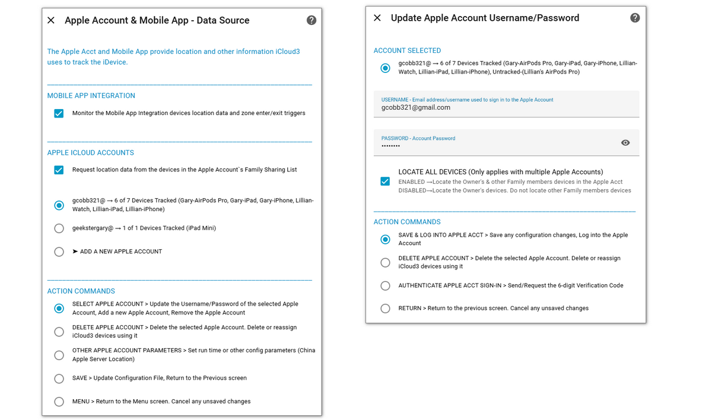
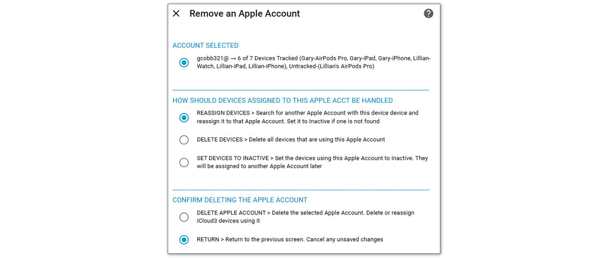
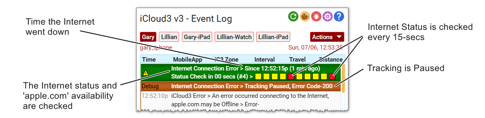

# Apple Account <!-- {docsify-ignore} -->

The Apple Account is the primary source of location data for iCloud3. It provides information related to the iPhones, iPads, Watches  and other devices in the Family Sharing list to the devices that are tracked and monitored.

Two screens are used to add and update Apple Accounts to iCloud3.

- **Apple Account & Mobile App - Data Source** > ***Configure Devices & Sensors > Apple Accts & Mobile App***
  - Enable/disable the Mobile App and Apple Account as a data source.
  - Add, update and delete the Apple accounts
  - Specify other special parameters related to setting up Apple accounts
- **Update Apple Account Username/Password**  > ***Apple Account & Mobile App - Data Source > Select Apple Account***
  - Select an existing Apple account or *Add a New Apple Account*, Then select *Select Apple Account*, then click *Submit*

-----

## Add, Update and Delete Apple Accounts

### Add, or Update an Apple Account

- Display the *Update Apple Account Username/Password* screen. 
- Enter the *Username* and *Password* fields.
- Select *Save & Log into Apple Acct*, then select *Submit*

The username and password are verified and the Apple account will be logged into. If the account is being added, the *Sign-in Warning  pop-up* screen is displayed on your Trusted Devices and the *Authenticate Apple Account Sign-in* screen is displayed for entry of the 6-digit verification code or for handling the hardware security key authentication (not available yet).

Note: The Apple account can locate only your devices or all devices in your Family Sharing list. Apple's location request may take slightly longer when this is enabled since it has to locate more devices. However, all tracked devices are updated when this is done.  See the *Family Sharing vs Owner's Devices when using several Apple Accounts* paragraph below for more information.

#### Changed Password

When you change the password, be sure to change it here. If you do not change it, iCloud3 will still log into the account until the Trust Token expires. Once it expires, the account login will fail and error messages are displayed in the Event Log. The account will also show 'Not Logged Into' on the Apple Accounts list. 

- Enter your new password in the Password field
- Select *Save & Log into Apple Acct*, then select *Submit*

### Deleting an Apple Account

- Display the *Update Apple Account Username/Password* screen. 
- Select *Delete Apple Account*, then select *Submit*
- The following confirmation screen is displayed:

- Select what to do with devices assigned to the Apple account being deleted.

- Select *Delete Apple Account*, then select *Submit*

  The Apple account will be deleted and the *Update Apple Account Username/Password* screen is displayed.

  

-----

## App Specific Password, Hardware Keys, Tracking Watch & AirTags

#### App Specific Password

App Specific Passwords can not be used with iCloud3. Apple does not provide an interface for web based programs like iCloud3 to use them. They can only be used by Apps installed on the iPhone or iPad. 

Try to log into your Apple Account at www.icloud.com from a browser. Use your username and the App Specific Password. It will fail.

#### Hardware Security Keys like Yubikey

Hardware security keys can not be used with iCloud3 to authenticate access to your Apple Account. 

If are using a Yubikey or other hardware key for your Apple Account and get an authentication request or if you request a new verification code, you will get the window requesting Apple account access approval as you normally do. You can approve the access but there is no method of linking that approval to iCloud3.

#### Tracking an Apple Watch

The Watch is tracked like any other iPhone or iPad. It is added on the *iCloud3 Devices* screen and configured on the *Update Devices* screen. 

Although the Mobile App Complication can be installed on the Apple Watch, there are a number of limitations regarding tracking :

- It does not provide location information.
- It will not receive notifications sent from iCloud3.
- Set the *Mobile App device* to *None*
- Set the *inZone Interval* to 15-minutes or less to minimize the delay when the device enters or exits a zone.
- Only assign a *Family Sharing* device to the tracked Watch device.

#### Tracking AirTags

These devices can not be tracked. They are not tracked by Apple like an iPhone or iPad and location information is not returned from iCloud Location Services for them.

-----

## China Users

A different URL is used to access the Apple Account servers in China (.cn is added to the URL). This is configured on the *Update Apple Account Username/Password* screen, *Apple Server Location* field. 

This selection field is displayed when the Home Assistant country code is `cn` or `hk`.

The HA Server contains the 2-character code for the location. The *Apple Server Location* field is displayed if it is 'cn' or 'hk'. If you are using a VPN, you may need this field to be displayed when the location code is not 'cn' or 'hk'.

- On the *Apple Accts & Mobile App* screen, select *Other Apple Account Parameters*, then Select *Submit*.
- Enable the *Apple Server Location (China)* field on the screen that is displayed.
- Select *Save*, then select *Submit*.

#### GPS Coordinates (GCJ-02 vs WGS-84)

GCJ-02 is a geodetic datum used in China that adds offsets to WGS-84 coordinates for security reasons and uses an algorithm that adds offsets to latitude and longitude to deviate from the actual WGS-84 coordinates. Apple has made Guizhou-Cloud Big Data, a company owned by the Guizhou provincial government, the legal owner of its Chinese customers' iCloud data. This means that maps in China, including those in Apple's iOS system, may show locations slightly offset from their actual WGS-84 coordinates. Apple servers in China likely use GCJ-02 for map data within Mainland China, Hong Kong, and Macao.

iCloud3 converts the GPS coordinates received from Apple servers in China from GCJ-02 values to WSG-84 values. The coordinates from the Mobile App are also converted if the device's Apple account use servers in China.

!> Since the Apple servers are in China, It is not known if a device's location is GCJ-02 or WGS-84 values when the device is not located in China.

*Note: This was added in iCloud3 v3.2*

-----

## Location and Family Sharing, Upgrading Devices

The following paragraphs provide additional information on various topics associated with the Apple account and requesting location and other data.

- Enable Location Sharing

- Internet Connection Errors

- Family Sharing vs Owner's Devices when using several Apple Accounts

- Upgrading to a new Device

- Event Log Startup Stage 4 - Apple Account Information

-  Apple Account Cookie and Session Files

#### Enable Location Sharing

Location Sharing must be enabled on all Apple devices that are tracked by iCloud3.

- **Settings App > Apple Account > Family > Location Sharing** screen
  - Enable *Share your location with* and *Automatically Share Location*
- **FindMy App > Me** screen
  - Enable *Share My Location*

!> The location of the devices you are tracking must be displayed on the *FindMy App > People* Map screen. If it is not displayed here, it's location is not shared and will not be returned to iCloud3 when it is requested.

#### Family Sharing vs Owner's Devices when using several Apple Accounts

This applies only when you are tracking devices using several Apple Accounts. If only one Apple Account is being used, all devices in the Family Sharing List are located on each location request sent to Apple.

When a device needs to be located, iCloud3 sends a location request to Apple. Apple locates <u>all</u> devices on the Family Sharing List, not just the one that issued the request. iCloud3 receives the location information and updates all tracked and monitored devices with the new information.

However, when you are using several Apple Accounts and both apple accounts are sharing the same devices, you can limit the devices located during a location request to those 'owned' by that Apple Account. There are benefits and determents associated with each method.

- Improved response time when an Apple account's devices are being located since Apple does not have to locate all the devices in the Family Sharing list. 
- Additional location requests must be sent to Apple to locate the devices on the other Apple account

For example: You have an Apple account with an iPhone and iPad (you are the owner) and your spouse has an iPhone and iPad (the spouse is the owner).

- Family Sharing devices - You and your spouse's iPhones and iPads are all located (4-devices) whenever one device is located. This can reduce the number of location requests sent to Apple, especially if the devices are close to each other. However, it takes Apple longer to locate all of them and it may return an old location if the device takes too long to locate. 
- Owner's Devices - When one of your devices needs to be located, the location request sent to Apple is only for your iPhone and iPad (2-devices). Your spouse's devices are not located at that time. Another location request is sent to Apple for them when they need to be located.

This is configured on the *Configure > Update Apple Account Username/Password* screen, *Always Locate All Devices* field.

- Enable - If the devices are usually located close to each other
- Disable - If this is another family members or a friends account

#### Upgrading to a new Device

The device's name (*Gary iPhone*) selected from the above list is stored in the iCloud3 configuration file. This is used to determine the actual Apple device providing location data when iCloud3 starts.

Several events take place when you upgrade a device, i.e, replace an iPhone 15 with an iPhone 16. 

- The apps, data and settings are transferred from the iPhone 15 to the iPhone 16.
- In this example, the name is on the iPhone 16 Pro Max is *Gary iPhone*. 
- A new name is assigned to the iPhone 16 Pro Max, i.e, *Gary iPhone (2)*.
- The iPhone 15 is assigned a new *device_id* by Apple. This *device_id* is used internally by Apple and you never see it. It is used, however, by iCloud3 to identify the actual device providing location data.
- The iPhone 15 is removed from the *FindMy App* and the Apple iCloud account and traded-in or sold.

At this time, iCloud3 is still tracking the *Gary iPhone/iPhone 15* that is no longer on your iCloud account instead of the new iPhone.

**Easy way** - The following steps should be done to make it easier to identify and transfer to the new iPhone:

- Rename the iPhone 15 from *Gary iPhone* to *Gary iPhone 15*. 
- Rename the iPhone 16 Pro Max from *Gary iPhone 15 (2)* back to *Gary iPhone* after you transfer the apps, data and settings.
- Restart iCloud3.

Since the new iPhone 16 Pro Max is now the *Gary iPhone* device, it will be now be assigned to the same iCloud3 tracked device.

**Harder way** - You realize that *Gary iPhone* is no longer being tracked because the iPhone is no longer on your Apple iCloud account or it has been wiped and powered off. 

- Restart iCloud3 - The Apple Account device list will be rebuilt with the current name.
  - Reconfigure the iCloud3 device on the *Update iCloud3 Device* screen - Select the new iPhone from the Apple Account iCloud Device list. 
  - Exit the Configure screens - iCloud3 will be restarted and the new iPhone's name will be assigned to the iCloud3 tracked device.
- Or, 
  - Change the name on the iPhone 16 Pro Max from *Gary iPhone (2)* to *Gary iPhone*.
  - Wait a few minutes until this name is re-registered with the Apple account.
  - Restart iCloud3 to reassign the name to the iCloud3 tracked device.

-----

## Internet Errors, Event Log Apple Info, Cookie Files

#### Internet Connection Errors

iCloud3 requests a location update when it is needed. Obviously, this request will fail if the Internet is down or www.icloud.com is not available. Various internet errors will trigger this - Connection Errors, Connection Timeouts, HTTP Errors, and many more. This is also triggered when the Internet Connection is available but www.icloud.com does not respond to a location request within 1-minute.

When this happens:

- An Internet Connection Error status message is displayed in the Event Log

- Tracking is Paused

- Every 15-seconds, a status request is made to see if it has been restored

- When is it is back up, www.icloud.com is checked to make sure a location a request is successful

- After it has been down for 3-minutes, an Internet Connection Error message is sent to the *icloud3_alerts* sensor

  

When the Internet Connection is restored and www.icloud.com is available:

- Tracking is resumed

- iCloud3 may restart if the Internet problem was detected when it was starting, when a verification code needs to be entered, when a Connection Error, Too Many Redirects, Proxy Errors, etc. or other error was encountered.

  

#### Event Log Startup Stage 4 - Apple Account Information

When iCloud3 starts, Stage 4 handles setting up the Apple Account and Mobile App devices. The following is done:

- Verify the Username/Password
- Read all of the devices in the Apple Account
- Match them up with the iCloud3 device using the Apple Account iCloud Device parameter from the *Update iCloud3 Device* screen
- Errors are identified. This includes login errors, missing devices, duplicate devices, authentication, changed device names, etc.

The results are shown in the *Event Log > Stage 4* screens. 

#### Apple Account Cookie and Session Files

Apple Account cookies and session data is stored in the *config/.storage/icloud3.apple_acct* directory for each Apple Account being used. These *cookie* and *session* files store tokens that are used to access your iCloud account without requesting a 6-digit verification code every time you start iCloud3 or request location data.

Changing and deleting these files will cause reauthentication requests from Apple and termination of your current login session and should not generally be done. These files can be deleted on the *Configure > Tools* screen.

