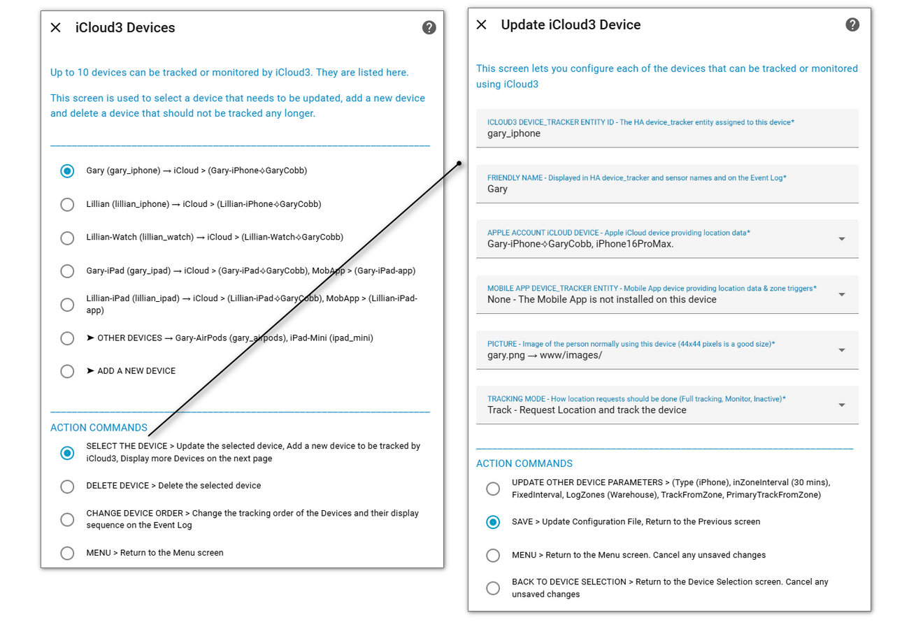
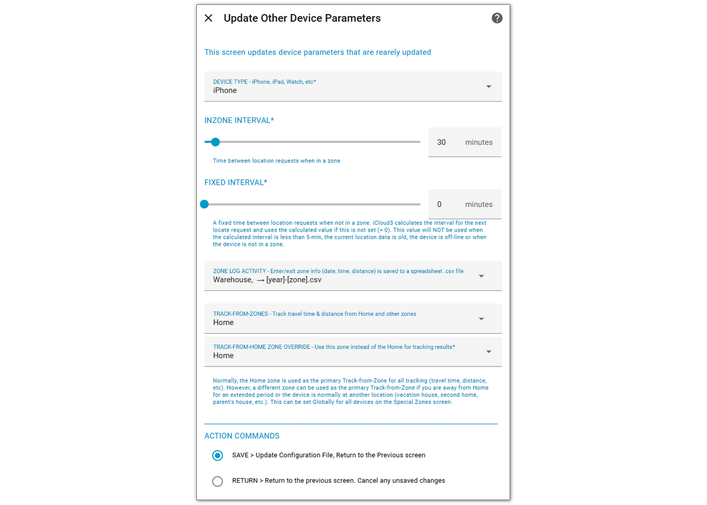
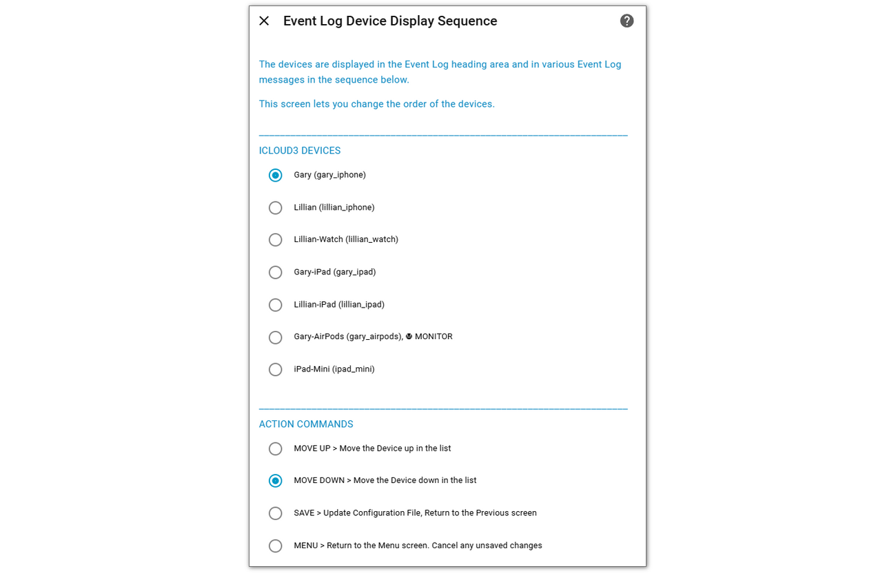

# iCloud3 Devices <!-- {docsify-ignore} -->

iCloud3 will track up to 10 iPhones, iPads and Watches. These screens list the devices you have added to iCloud3 to be tracked or monitored and 

- **iCloud3 Devices** - on the left below:
  - Lists the devices that will be tracked and monitored
  - Select the device to be updated or deleted
  - Add a new iCloud3 device
  - Change the order of the devices on the Event Log
- **Update iCloud3 Devices** - on the right below:
  - Selected from -  *Apple Account & Mobile App - Data Source* screen
  - Update the parameters on an existing iCloud3 device
  - Add a new iCloud3 device
  - Specify the Apple/iCloud Account and Mobile App that provide location and other data for this device

## Update iCloud3 Devices

Fields that are updated on this screen:

1. **iCloud3 device_tracker Entity ID**  (*gary_iphone*) - The unique name used to create the device_tracker entity (device.tracker.gary_iphone) and sensor entities (sensor.gary_iphone_battery_level).

2. **Friendly Name** -  Typically, this is the same as the name on the *Settings App > General > About* value.

3. **Apple/iCloud device, Mobile App device** - Apple and Mobile App device providing location, zone and other data. See examples of the lists below.

4. **Picture or icon** - An image file that is displayed on the dashboard. See examples of the lists below.

5. **Tracking Mode** - Describes how the device will be tracked: 

   - **Track** - Actively requests the location and track the device,

   - **Monitor** - Do not request the location. Report it's location when a tracked device is updated using data that is also  returned from iCloud

   - **Inactive** - Not tracked or monitored. This option keeps the device's parameters in the the configuration file but does not track it. 

## Assigning the iCloud and Mobile App Device

When iCloud3 starts, the Apple Accounts are opened and the devices in the accounts are retrieved. The devices in the Mobile App Integration are also identified. When an iCloud3 device is added, the iCloud and Mobile App devices that will provide location, battery status, current zone and other data are assigned by selecting the corresponding device from the list of devices detected when iCloud3 started.

Below are examples of these selection lists:

## Rarely Updated Parameters

There are several parameters that further configure the device that are rarely updated: These include:

- **Device Typ**e (*iPhone, iPad, Watch*) - Type of the device that help identify it on the Event Log.
- **InZone Interval** - Time between location requests when the device is in a zone.
- **Fixed Interval** - Normally, the next location update is determined by the distance from Home (or another tracked zone) and the direction. This overrides that calculation and will request a location update on a fixed time frame.
- **Log Zone Activity** - Update a csv file when the device enters a zone with the date/time, zone, and length of time in the zone. This can be used for expense reporting records. This is described in detail in the Advanced Features chapter [here]().
- **Track from Zone**s - The device always updates the time and distance from the Home zone. This selects other zone(s) you also want to track the time and distance from.
- **Track from Home Zone Override** - The Home zone is the main zone for all activities. Examples of when you might want to override the Home zone and set another zone as the main zone include you are away from Home (at a second home, on vacation), the device belongs to your parents and you want to monitor where they are in relation to their house.

## Change Device Order

