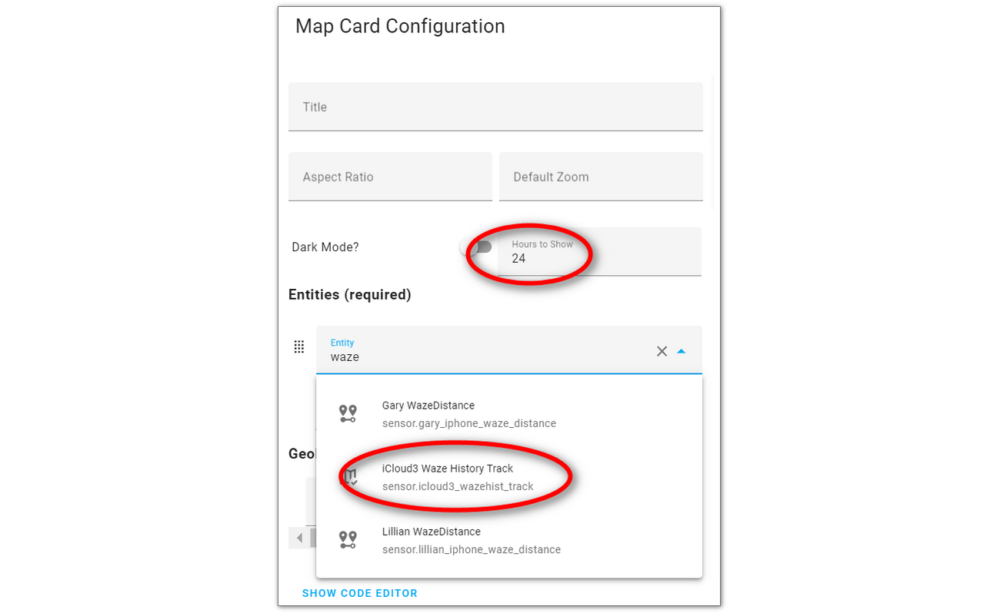

# Display the Waze History Locations on a Map Card

Use the *sensor.icloud3_wazehist_track* sensor entity as the source of a Lovelace map card to see the locations of all of the 11m locations points that have been saved. 

Create a Lovelace map card:



Or copy the yaml code below into the *Show Code Editor* yaml code field on a new Lovelace card.

```type:yaml
type: map
entities:
  - entity: sensor.icloud3_wazehist_track
title: WazeHistory GPS
hours_to_show: 24
dark_mode: false
```

After the location data has been loaded into the sensor, the resulting map card looks similar to the map below. 


> This really does not have any practical use but it was a fun project to see how many locations had been saved.

Each of the dots on the map is a saved location. Unfortunately, Home Assistant treats the locations on the map card as a tracking point and draws a line between the points in the order they were loaded. Ignore the lines.

To try to display the points in a logical order based on your most frequent driving direction, select *North-South* or *East-West* in the *Waze Location Map Display* field on the *Waze - History Database* parameter screen.


## How to Remove the Lines Between the Locations  {docsify-ignore}

The lines between the locations dots can be removed using the *card-mod* Lovelace custom style developed by Thomas Loven. With *card-mod*, custom CSS styles can be applied to various elements of the Home Assistant frontend (element colors, icons, borders, etc.). Information about *card_mod* can be found [here](https://github.com/thomasloven/lovelace-card-mod/blob/master/README.md).

> Using this custom style, the North-South and East-West track direction is irreverent since the lines between the locations is not displayed.

The installation is described in the *card-mod* documentation and below.

1. Install *card_mod* with Hacs. (Hacs > Frontend > Search for *card-mod* > Lovelace > Download)

2. Add the following to your `configuration.yaml` file and restart Home Assistant.

   ```
   frontend:
     extra_module_url:
       /community/lovelace-card-mod/card-mod.js
   ```

   Change the path if you have moved the *card-mod.js* file to another location. The *card_mod* documentation show it being installed in *hacsfiles* but if you installed through HACS, it is probably in the *www/community/lovelace-card-mod/* directory. 

3. Edit the Lovelace map card configuration parameters described above and add the following to it. 

   ```type:yaml
   card_mod:
     style:
       ha-map$:
         .leaflet-pane: |
           path {
             fill: red;
             stroke: none;
           }
         .leaflet-overlay-pane: |
           path {
             fill: red;
             stroke: none;
           }
   ```


After the location data has been loaded into the sensor, the map card now looks like this.


## Loading the saved locations  {docsify-ignore}

The saved locations are loaded into the *sensor.icloud3_wazehist_track* sensor entity several ways.

- Each night at midnight.
- Immediately by selecting *Event Log > Actions > WazeHist - Load track locations for map*
- Immediately by selecting *iCloud3 Configurator > Actions > Waze Hist Map Track - Load route locations for map display*

