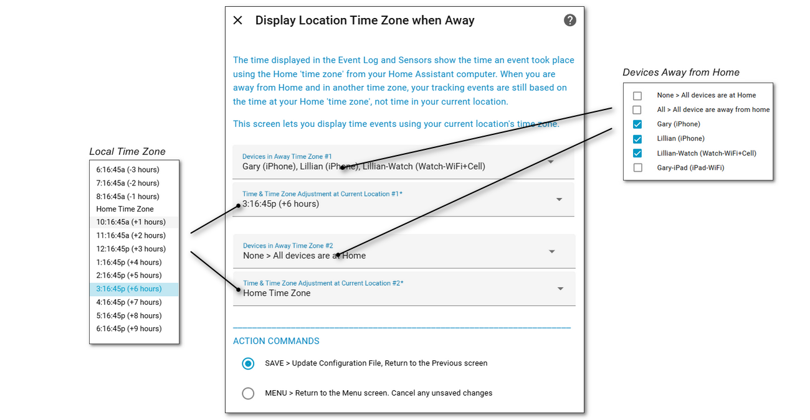

# Away Time Zone <!-- {docsify-ignore} -->

##### Selected From: *Configure Parameters Menu*

The time displayed in the Event Log and Sensors show the time an event took place using the Home 'time zone' from your Home Assistant computer.  When you are away from Home and in another time zone, your tracking events are still based on the time at your Home 'time zone', not time in your current location. This screen lets you display time events using your current location's time zone.

The following fields are available:

- **Devices in Away Time Zone #1 and #2** - The devices that are away

- **Time & Time Zone Adjustment at Current Location #1 & #2** - The time at your current location 

