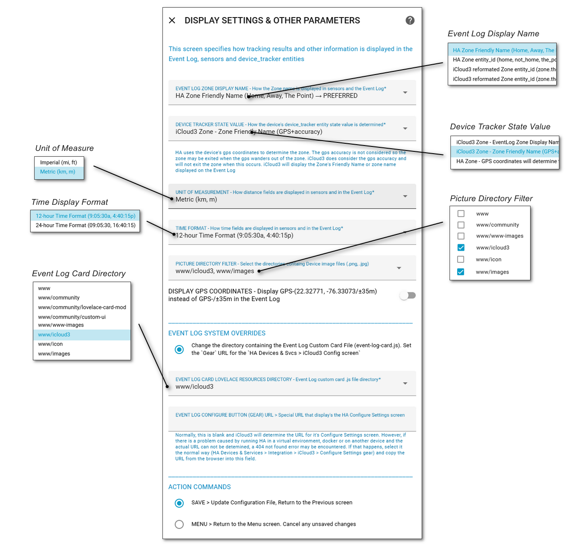

# Display Settings & Other Parameters <!-- {docsify-ignore} -->

##### Selected From: *Configure Parameters Menu*

This screen specifies how tracking results and other information is displayed in the Event Log, sensors and device_tracker entities.

The following fields are available:

- **Event Log Zone Display Nam**e - How the Zone name is displayed in sensors and the Event Log

- **Device Tracker State Value** - How the device's device_tracker entity state value is determined

- **Time Format** - How time fields are displayed in sensors and in the Event Log (12-hour time, 24-hour time)

- **Unit of Measure** - How distance fields are displayed in sensors and in the Event Log (mi, km)

- **Display GPS Info** - Display the GPS (Latitude, Longitude/±Accuracy) or only the GPS (/±Accuracy) in the Event Log
- **Display GPS Coordinates** - Display GPS-(22.32771, -76.33073/±35m) instead of GPS-/±35m in the Event Log

- **Picture Directory Filter** - Select the directories containing Device image files (.png, .jpg)

- **Event Log Card Dashboard Resources Directory** - Event Log custom card .js file directory

- **Event Log 'Gear' Icon URL** > Special URL that display's the HA Configure Settings screen

  

