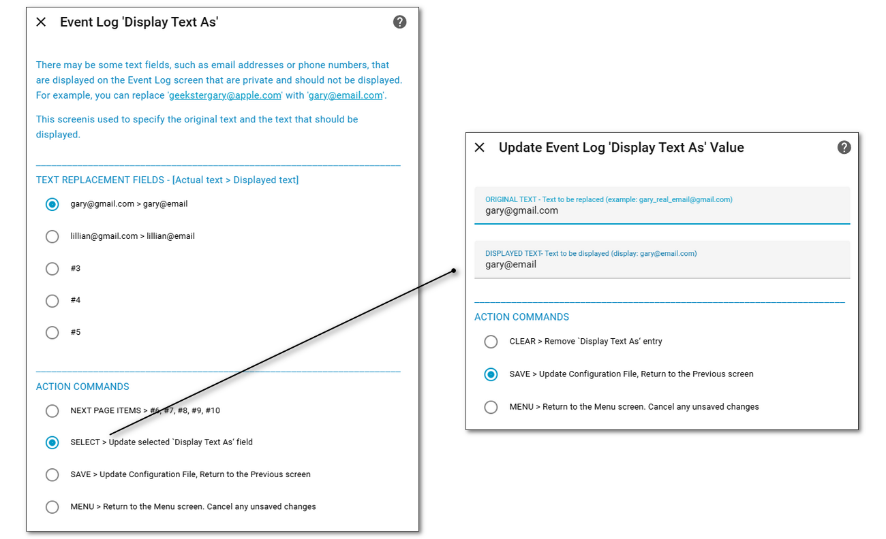

# Display Text As <!-- {docsify-ignore} -->

##### Selected From: *Configure Parameters Menu*

There may be some text fields, such as email addresses or phone numbers, that are displayed on the Event Log screen that are private and should not be displayed. For example, you can replace 'geekstergary@apple.com' with 'gary@email.com'. This screen is used to specify the original text and the text that should be displayed.

The following fields are available:

- **Original Tex**t - Text to be replaced (example: gary_real_email@gmail.com)

- **Displayed Text** - Text to be displayed (display:  gary@email.com)

  

