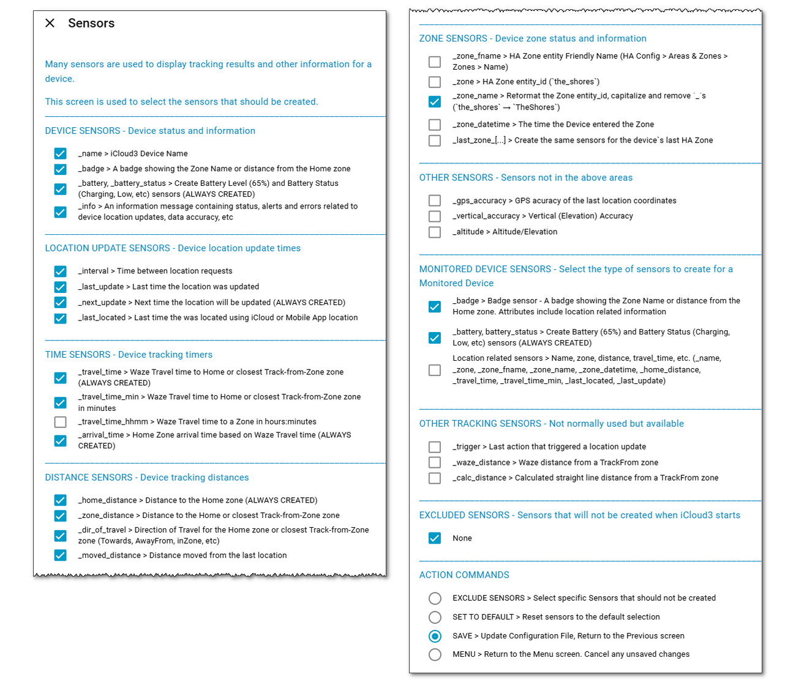
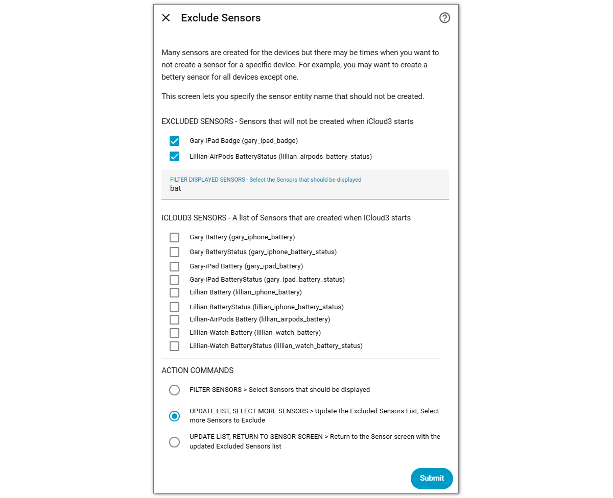

# Sensors <!-- {docsify-ignore} -->

##### Selected From: *Configure Devices & Sensors Menu*

Many sensors are used to display tracking results and other information for a device. This screen is used to select the sensors that should be created and to exclude specific sensors from being created.

### Creating, Deleting and Excluding a Sensors

The Sensor Groups below list the sensors that can be created in several categories. 

- **Tracked devices** - Enabling the sensor will create it and add it to the HA entities registry, disabling the sensor will prevent it from being created and remove it from the HA entities registry. 

- **Monitored devices** - These devices are not actively tracked but are updated when another tracked device is updated and are a little different. A special _Monitored Device sensors_ category list groups of sensors that will be created. They are badge sensors, battery sensors and location sensors.

- **Excluding sensors** - You can prevent a specific sensor for a specific device from being created using the _Excluded Sensors_ screen. For example, you want to track an iPad but you are not interested in the polling interval, next or last update time or when it was last located. These specific sensors can be added to the excluded list and they will not be created.

#### Deleting or disabling a sensor on the iCloud3 Integration screen or HA Entities screen

> !  This is not recommended. Use _Sensors > Exclude Sensor_ screen instead.

It is possible to delete or disable a sensor from outside of iCloud3 on these screens. However, this causes a conflict between the iCloud configuration file and the HA entity registry files. To prevent this conflict:

- The sensor is added to the Excluded Sensors List in the iCloud3 configuration file which prevents it from being recreated when iCloud3 restarts
- The sensor entity is removed from the HA entity registry files active and deleted lists so it can not be reenabled from the HA screens.

The sensor is listed in the Excluded Sensors group. Uncheck the sensor to recreated it.

### Sensor Groups

The sensors are grouped into the following categories:

- **Monitored devices sensors**:

  - **_badge** - Badge sensor - A badge showing the Zone Name or distance from the Home zone. Attributes include location related information
  - **_battery , _battery_status** - Create Battery (65%) and Battery Status (Charging, Low, etc) sensors (Always Created)
  - **_location_sensors** - Location related sensors > Name, zone, distance, travel_time, etc. (_name, _zone, _zone_fname, _zone_name, _zone_datetime, _home_distance, _travel_time, _travel_time_min, _last_located, _last_update)

- **Tracking update sensors**:

  - **_interval** - Time between location request
  - **_last_update** - Last time the location was updated
  - **_next_update**  - Next time the location will be updated (Always Created)
  - **_last_located** - Last time the was located using iCloud or Mobile App location

- **Tracking time sensors:**

  - **_travel_time** - Waze Travel time to Home or closest Track-from-Zone zone (Always Created)
  - **_travel_time_min** - Waze Travel time to Home or closest Track-from-Zone zone in minutes
  - **_travel_time_hhmm** - Waze Travel time to a Zone in hours:minutes
  - **_arrival_time** - Home Zone arrival time based on Waze Travel time (Always Created)

- **Tracking distance sensors**:

  - **_home_distance** - Distance to the Home zone (Always Created)
  - **_zone_distance** - Distance to the Home or closest Track-from-Zone zone
  - **_dir_of_travel** - Direction of Travel for the Home zone or closest Track-from-Zone zone (Towards, AwayFrom, inZone, etc)
  - **_moved_distance** - Distance moved from the last location

- **Track from Zone sensors**:

  - **_zone_fname** - HA Zone entity Friendly Name (HA Config > Areas & Zones > Zones > Name)
  - **_zone** - HA Zone entity_id (`the_shores`)
  - **_zone_name** - Reformat the Zone entity_id, capitalize and remove `_`s (`the_shores` → `TheShores`)
  - **_zone_datetime** - The time the Device entered the Zone
  - **_zone_fname** > HA Zone entity Friendly Name (HA Config > Areas & Zones > Zones > Name)
  - **_last_zone[...]** - Create the same sensors for the device`s last HA Zone

- **Other tracking sensors:**

  - **_gps_accuracy** - GPS accuracy of the last location coordinates
  - **_vertical_accuracy** - Vertical (Elevation) Accuracy
  - **_altitude** - Altitude/Elevation

- **Excluded sensors** -  Sensors that will not be created when iCloud3 starts

## Exclude Sensors

This screen is used to add sensors for a specific device to the Exclude Sensors list.

### Filter the list of available sensors

A list of [devicename]_[sensorname] entities to select from is displayed on this screen. This list can be filtered to the ones you are interested in. _

1. Enter part of the sensor name in the _Filter Displayed Sensors_ field.
2. Select **Filter Sensors**, then select **Submit**. Only sensors with the Filter text are displayed.

The screen image below, _bat_ was entered to list all sensors with _bat- in the entity name (battery, battery_status).

### Add Excluded Sensor

1. Enter part of the name in the _Filter Displayed Sensors_ field, select Submit.
2. Check the sensors to be added to the list.
3. Select **Update List, Return to Sensor Screen**. then select **Submit**.
