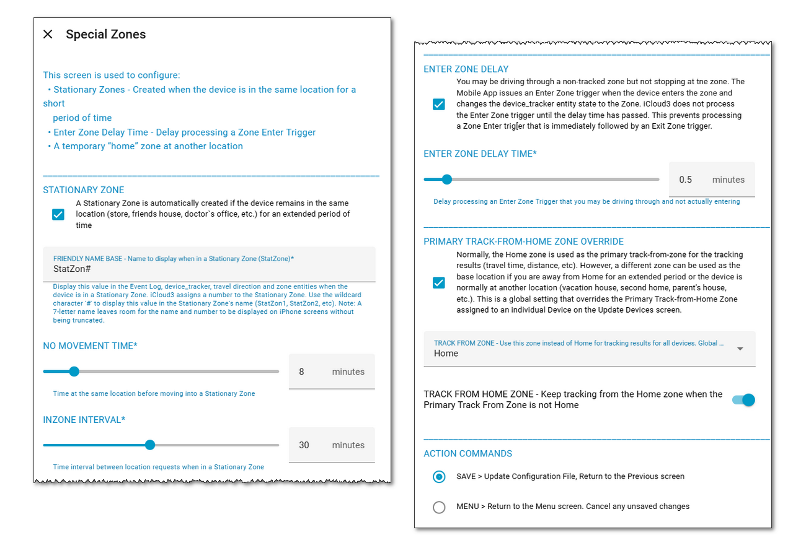

# Special Zones <!-- {docsify-ignore} -->

##### Selected From: *Configure Parameters Menu*

This screen is used to configure:

- **Stationary Zones** - A temporary Stationary Zone is created when the device is in the same location for a short period of time. This may be a doctor's office, mall, store, friends house, etc. It is used to control the number of location requests sent to Apple.
  - Disable the check box if you do not want to use a Stationary Zone
  - **No Movement Tim**e - Time at the same location before moving into a Stationary Zone
  - **InZone Interval** - Time interval between location requests when in a Stationary Zone
  - **Stationary Zone Name** - Display this value in the Event Log, device_tracker, travel direction and zone entities when the device is in a Stationary Zone. iCloud3 assigns a number to the Stationary Zone. Use the wildcard character '#' to display this value in the Stationary Zone's name (StatZon1, StatZon2, etc). Note: A 7-letter name leaves room for the name and number to be displayed on iPhone screens without being truncated.
- **Enter Zone Delay Time** - You may be driving through a non-tracked zone but not stopping at the zone. The Mobile App issues an Enter Zone trigger when the device enters the zone and changes the device_tracker entity state to the Zone. iCloud3 does not process the Enter Zone trigger until the delay time has passed. This prevents processing a Zone Enter trigger that is immediately followed by an Exit Zone trigger.
  - Disable the check box if you do not want to immediately enter a zone 
-  **Primary Track-from-Home Zone Override** - Normally, the Home zone is used as the primary track-from-zone for the tracking results (travel time, distance, etc).  However, a different zone can be used as the base location if you are away from Home for an extended period or the device is normally at another location (vacation house, second home, parent's house, etc.). This is a global setting that overrides the Primary Track-from-Home Zone assigned to an individual Device on the Update.
  - **Track from Zone** - Normally Home. The zone you want to use as your 'Home' zone

