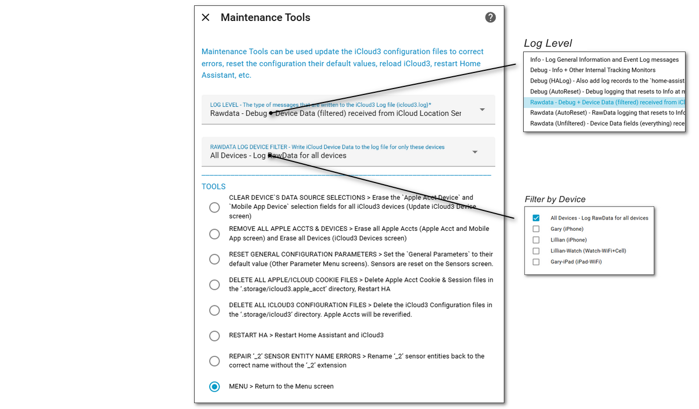

# Maintenance Tools <!-- {docsify-ignore} -->

##### Selected From: *Configure Devices & Sensors Menu*

This screen can be used to change the iCloud3 Log Level, update the iCloud3 configuration files to correct errors, reset the configuration their default values, reload iCloud3, restart Home Assistant, etc.

### Log Level

The type of messages that are written to the iCloud3 Log file (icloud3.log

- **Info** - Log General Information and Event Log messages
- **Debug** - Info + Other Internal Tracking Monitors
- **Debug (HALog)** - Also add log records to the `home-assistant.log` file
- **Debug (AutoReset)** - Debug logging that resets to Info at midnight
- **Rawdata** - Debug + Device Data (filtered) received from iCloud Location Servers
- **Rawdata (AutoReset)** - RawData logging that resets to Info at midnight
- **Rawdata (Unfiltered)** - Device Data fields (everything) received from iCloud Location Servers
- **Rawdata Log Device Filter** - Write iCloud Device Data to the log file for only these devices

### Tools

Various tools that will perform maintenance actions on the iCloud3 Configuration file and Apple account cookie and session files.

-  **Clear Device's data Source Selections** -  Erase the Apple Acct Device and Mobile App Device selection fields for all iCloud3 devices (Update iCloud3 Device screen)

-  **Remove all Apple Accounts and Devices** - Erase all Apple Accts (Apple Acct and Mobile App screen) and Erase all Devices (iCloud3 Devices screen)

-  **Reset General Configuration Parameters** - Set the General Parameters to their default value (Other Parameter Menu screens). Sensors are reset on the Sensors screen.

-  **Delete All Apple Cookie Files** - Delete Apple Acct Cookie & Session files in the **.storage/icloud3.apple_acct* directory, and Restart HA

-  **Delete All iCloud3 Configuration Files** - Delete the iCloud3  Configuration files in the *.storage/icloud3* directory. 

-  **Restart HA** - Restart Home Assistant and iCloud3

-  **Repair _2 Sensor Entity Name Errors** - Rename ‘_2’ sensor entities back to the correct name without the *_2* extension

  

