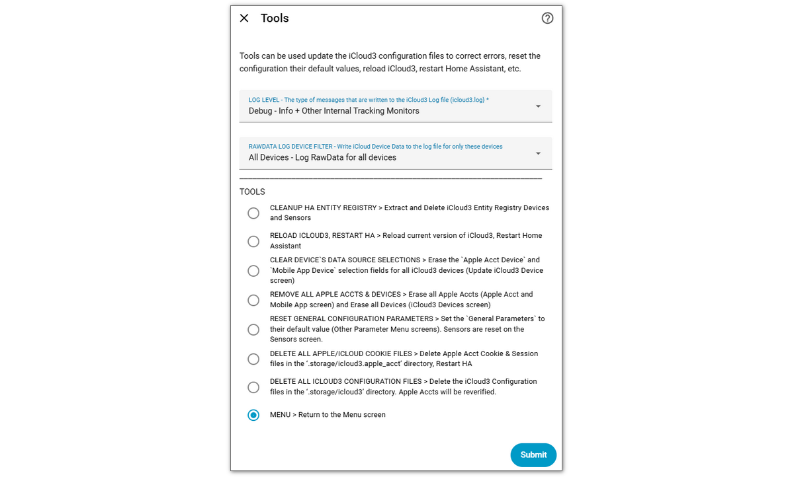
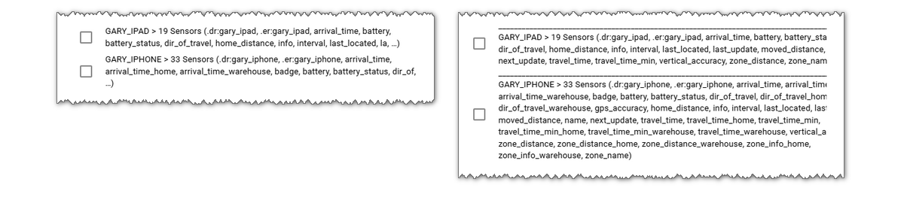
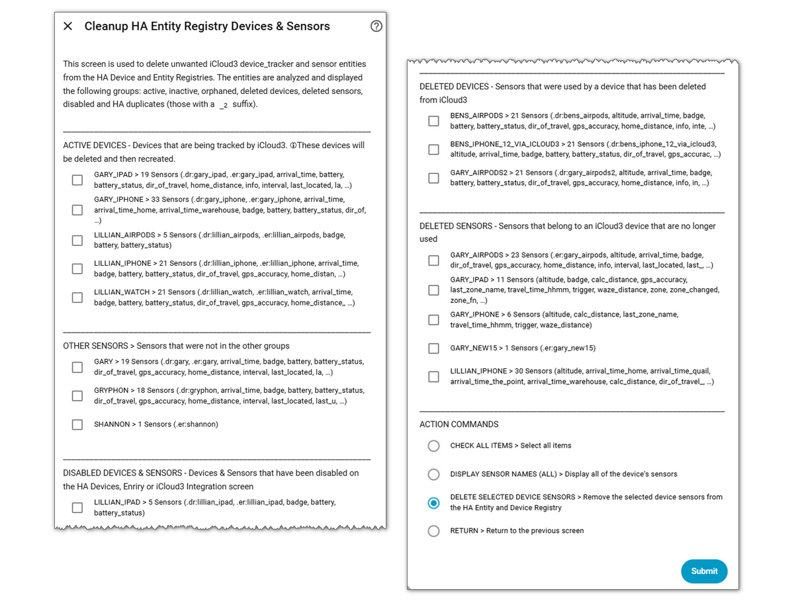

# Tools <!-- {docsify-ignore} -->

##### Selected From: *Configure Devices & Sensors Menu*

This screen can be used to change the iCloud3 Log Level, update the iCloud3 configuration files to correct errors, reset the configuration their default values, reload iCloud3, restart Home Assistant, etc.

### Log Level

The type of messages that are written to the iCloud3 Log file (icloud3.log

- **Info** - Log General Information and Event Log messages
- **Debug** - Info + Other Internal Tracking Monitors
- **Debug (HALog)** - Also add log records to the `home-assistant.log` file
- **Debug (AutoReset)** - Debug logging that resets to Info at midnight
- **Rawdata** - Debug + Device Data (filtered) received from iCloud Location Servers
- **Rawdata (AutoReset)** - RawData logging that resets to Info at midnight
- **Rawdata (Unfiltered)** - Device Data fields (everything) received from iCloud Location Servers
- **Rawdata Log Device Filter** - Write iCloud Device Data to the log file for only these devices

### Tools

Various tools that will perform maintenance actions on the iCloud3 Configuration file and Apple account cookie and session files.

-  **Cleanup HA Entity Registry** - Lists the iCloud3 devices and sensor entity items from the HA Device and Entity Registries, delete the selected devices and sensors from the HA registries
-  **Reload iCloud3, Restart HA** - Reload the current version of iCloud3 and Restart Home Assistant. *This does not load a new version of iCloud3.*
-  **Clear Device's Data Source Selections** -  Erase the Apple Acct Device and Mobile App Device selection fields for all iCloud3 devices (Update iCloud3 Device screen)

-  **Remove all Apple Accounts and Devices** - Erase all Apple Accts (Apple Acct and Mobile App screen) and Erase all Devices (iCloud3 Devices screen)

-  **Reset General Configuration Parameters** - Set the General Parameters to their default value (Other Parameter Menu screens). Sensors are reset on the Sensors screen.

-  **Delete All Apple/iCloud Cookie Files** - Delete Apple Acct Cookie & Session files in the **.storage/icloud3.apple_acct* directory, and Restart HA

-  **Delete All iCloud3 Configuration Files** - Delete the iCloud3  Configuration files in the *.storage/icloud3* directory. 

-  

# Cleanup HA Entity Registry Devices & Sensors

This screen scans the HA Entity and Device registries and displays iCloud3 entities in following the categories:
   - **Active** - Devices being tracked or monitored
   - **Inactive** - Devices that are set to `Inactive` and not tracked by iCloud3
   - **Orphaned** - Sensors that once existed but are no longer associated with the iCloud3 Integration
   - **Disabled** - Devices & Sensors that have been disabled on the HA Devices, Entity or iCloud3 Integration screen
   - **Suffix Error**s - Sensors that have been duplicated by HA and are now unavailable
   - **Deleted Devices** - Sensors that were used by a device that has been deleted from iCloud3

- **Deleted Sensor**s - Sensors that belong to an iCloud3 device that are no longer used
      

Removing all traces of a device or sensor from the HA Registries can solve various problems, including:

- Devices and sensors with duplicate entities not being created
- Sensors not being creating because they have been disabled in HA but Active in iCloud3
- Unused sensors are preventing new sensors with the same name for a new device not being created

### Device Information

The device and it's sensors can be displayed showing an abbreviated list (left) or showing all of the sensors (right).  Use the _Display Sensor Names (2-Lines/All)_ to toggle the display. 

The device_tracker entity actually resides in two HA files, the _.storage/core.device_registry_ and _.storage/core.entity_registry_. This is noted in the sensor list by the _.dr:_ and  _.er:_ prefix (.dr:gary_iphone and .er:gary_iphone).

## Deleting a device and sensor entities

To delete the items from the registry:

1. Check the device to delete
2. Select **Delete Selected Device Sensors**, select **Submit**

Note: Select *Check All Items/Uncheck All Items* to select or unselect all devices.

- Non-Active categories can be removed from the Registry files. 
- Active are removed and then recreated since they belong to iCloud3 devices being tracked or monitored

