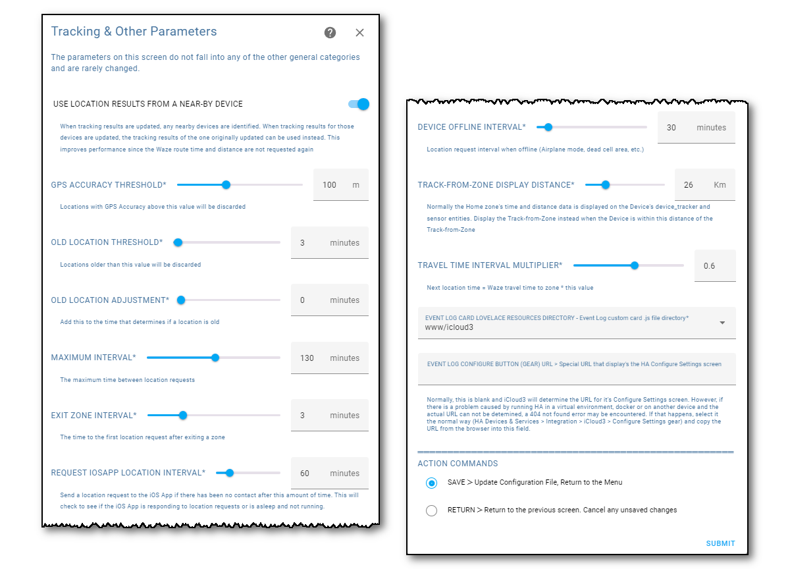

# Tracking & Other Parameters <!-- {docsify-ignore} -->

##### Selected From: *Configure Parameters Menu*

This screen is used to configure other parameters that do not belong on the previous screens.

Notes:

- **Log Level** - Several levels of logging are available to help provide information when trying to identify a problem. Records are added to the HA Log file (*config/home-assistant.log*). This is explained further in the *Trouble Shooting Problems* chapter.
  - **Debug** - Basic information.
  - **RawData** - Actual data values used when zones and devices are set up, the actual data received from iCloud Location Services after  requesting a location or authenticating an account and the actual data being monitored from the Mobile App.

