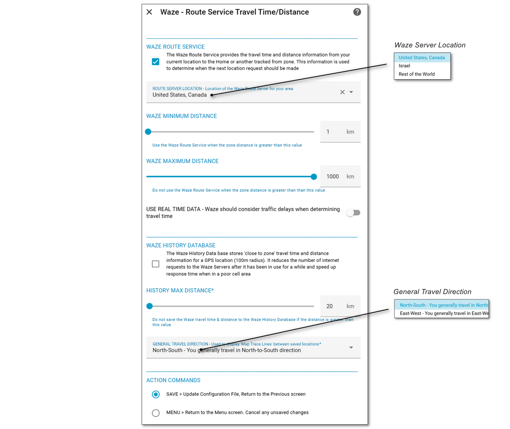

# Waze Route, Time & Distance <!-- {docsify-ignore} -->

##### Selected From: *Configure Parameters Menu*

iCloud3 uses the Waze Route service to get the time and travel distance from the device's current to the Home or other tracked zone. This information is saved in the Waze History Database in 100 meter increments. The database is queried before sending the request to Waze to improve performance and minimize internet traffic in poor locations. This screen is used to configure Waze.

The following fields are available:

- **Route Server Location** - Location of the Waze Route Server for your area (US, IS, Rest of the World)
- **Use Real Time Data** - Waze should consider traffic delays when determining travel time
- **Minimum Distance** - Do not use Waze if the devices is less than this distance from Home or the tracked zone
- **Maximum Distance** - Do not use Waze if the device is greater than this distance and a long way from Home or the tracked zone
- **General Travel Direction** - Used to display 'Map Trace Lines' between saved locations
- **History Database** - Enable/Disable using the Waze History Database
- **History Max Distance** - The database is most useful for regular travel routes. It does not make sense to fill up the database with data that will never be used again. Do not store Waze data in the database for locations greater than this distance. 

