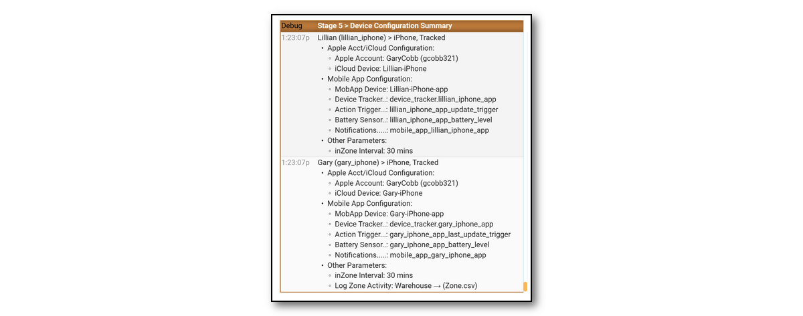

## Troubleshooting Tools {docsify-ignore}

-----

## Event Log

- **Stage 3 > Prepare Configured Device**s - This stage shows each device that will be tracked and the parameters in the configuration. If no devices are displayed, than Sharing has not been enabled for the devices. If you just enabled it, restart iCloud3 using the  *Event Log > Actions > Restart iCloud3* selection.

- **Stage 4 > Setup iCloud & Mobile App Tracking Methods, Family Sharing List devices** - This stage lists all of the devices in the Family Sharing List on your iCloud account. 

  - A *check mark* indicates the device is being tracked by iCloud3. 

  - A *No Location* message indicates iCloud did not return any location information. iCloud3 will do several retries to clear this up before displaying an error message.

  - A *Not Tracked* message indicates this device is not in the iCloud3 configuration.

    

- **Things to look for:**

  -  Stage 4 - Every device in the Family Sharing list is listed. This includes the current iPhones, iPads, etc. along with old devices you no longer have.
  -  Stage 4 - Make sure there are no duplicate devices names for different models (for example: Gary-iPhone/iPhone 12, Gary-iPhone (2)/iPhone 13 Pro, etc). If there is, delete the old device from the Family Sharing List, change the name on the device itself (Settings > General > About) and select the correct device in the iCloud3 Configuration Wizard.
  -  Stage 3 - Make sure the device assigned in the configuration is correct and not  duplicate or old device that you no longer own.

- **Stage 5 > Configure Tracked Devices** - This screen is a summary of how the device is set up. 

  - It shows the monitored and tracked devices
  - The actual entities or devices that have been assigned:
    - FamShr Device - The device from the family Sharing List
    - Mobile App Entity device - the HA device_tracker entity name
    - Update Trigger - The Mobile App's update trigger sensor that is monitored
    - Battery - The Mobile App's Battery sensor entity that is monitored for the battery level
    - Notifications - Where messages will be sent using the Mobile App
    - Track from Zones -  The zones that are tracked from when tracking from more than one zone

​    

-----

## Exporting the Event Log

The Event Log is exported to the file */config/icloud3-event-log_[date]_[time].txt* file using the following methods:

- Select *Export Event Log* from the *Event Log > Actions* drop down menu.
- Select *Export Event Log* from the *Configurator > Actions* menu.

The sections on the report are:

- Device configuration parameters
- General configuration parameters
- Start up results
- Device location and tracking results

-----

### Debugging with Tracking Monitors

Tracking monitors can be displayed to identify errors and help answer questions related to device availability, poor location data errors, how the tracking results are calculated, etc. The messages are displayed in blue to help identify and highlight them.

- Select *Event Log > Actions > Show/Hide Tracking Monitors* command. 

Below are sample Tracking Monitors screens.

			*Event Log Tracking Monitors during start up*

		*Event Log Tracking Monitors while away from Home*

		*Event Log Tracking Monitors while away from Home

-----

### Debugging with Log Level

The *Log Level* on the *Event Log > Actions* drop down list and on the *Configurator > Other Parameters* screen specify the type of logging records to add to the Home Assistant log file (*home-assistant.log*). They are:

**Info** - Normal operations, add few records for the results of a location request.

**Debug** - Add more detailed records related to location requests, how the data is processed and the results.

**RawData** - Add records for setting up iCloud3 (device_tracker and sensor entities, zones, devices, etc.), the Mobile App data used to handle location update and triggers and the data requested from and received from iCloud Location Servers.

