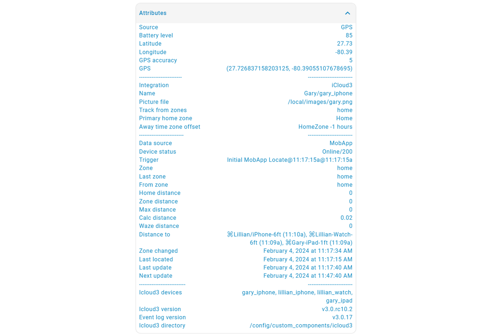
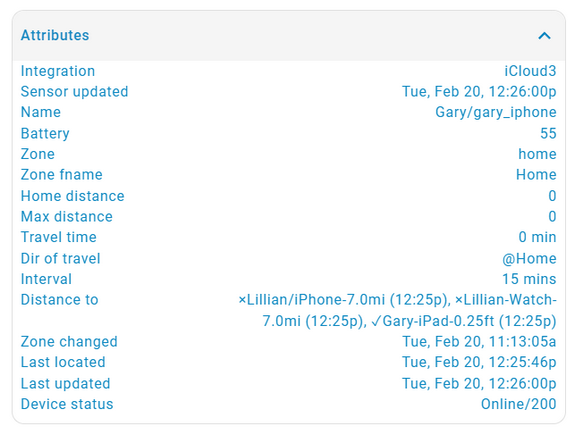
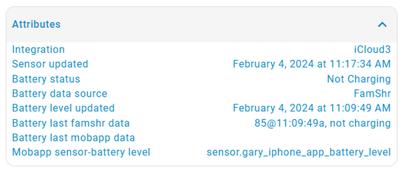
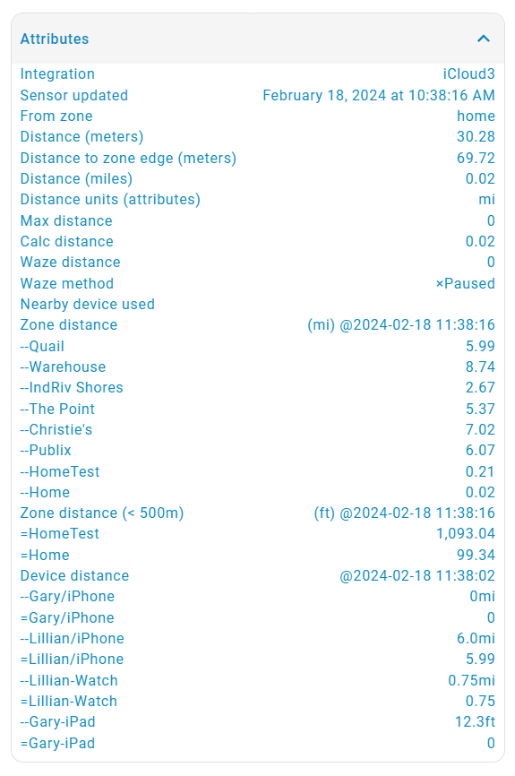
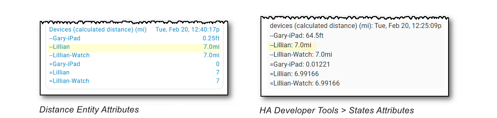

# iCloud3 Sensor Attributes

Many attributes are updated when the device is polled for it's location, distance and the travel time from Home or another zone. They can be used in automations and scripts and displayed on Lovelace Cards.  Sensors are created also for many of the attributes and are discussed in further detail in the Sensors chapter.


### Device Tracker Attributes

The following shows the attributes for the *device_tracker.gary_iphone* entity.




### Sensor Attributes

The following table shows screenshots of the attributes for various types of sensors that are updated by iCloud3.

| Badge Sensor                       | Battery Sensor                       |
| ---------------------------------- | ------------------------------------ |
|  |  |

| Travel Time, Travel Time Minutes, Arrival Time Sensor   | Arrival Time Sensor when in a zone |
| ---------------------------------- | ----------------------------------- |
|  |  |

| Home Distance, Zone Distance Sensors |  |
| ---------------------------------- | ------------------------------------ |
|  |  |


### Using a Sensor Attribute on a Dashboard Card

Sensor attributes can be displayed on an *entity card* on the dashboard using the *- type: attribute* parameter. 

The following example will display the distance from one device to another using attributes on the *sensor.gary_iphone_home_distance* and *sensor.gary_iphone_zone_distance* entities.



The distance between devices is displayed two ways:

- as a string value - The attribute displayed on *sensor.gary_iphone_home_distance* for '--Lillian/iPhone' is 7.00mi. These attribute names start with '--'.
- as a numeric value - The actual value is stored internally as 6.99166 and can be displayed on the *HA Developer tools > States* screen. These attribute names start with '='.

> [!IMPORTANT]
> Note: The distances between the devices may not be the same as the *_home_distance* or *_zone_distance* state value.
>
> - The distance between devices is the *calculated distance*, the straight line distance between two gps points. 
>
> - The *_home_distance* and *_zone_distance* state value may be the *Waze Route Distance*, the driving distance between the same two points that was returned from the Waze Route server.

The *entities* card is created with the *attributes* secondary information parameters. This is described in the HA Entities Dashboard Documentation [here](https://www.home-assistant.io/dashboards/entities/). This must be created using YAML code in the Dashboard edit screen. The following dashboard screen was created with the yaml code below.


```YAML
  - type: entities
    entities:
      - type: attribute
        entity: sensor.gary_iphone_home_distance
        attribute: '--Lillian/iPhone'
        name: Gary <--> Lillian Distance
      - type: attribute
        entity: sensor.lillian_iphone_home_distance
        attribute: '--Lillian-Watch'
        name: Lillian <--> Lillian Watch Distance
      - type: attribute
        entity: sensor.gary_iphone_home_distance
        attribute: '--Gary-iPad'
        name: Gary <--> Gary-iPad Distance

```

Copy and paste this onto the dashboard screen you want to create that will show the distance between devices. Change the sensor entities to the names of your devices and change the name description for the unit-of-measure you are using. 

Attributes from other sensors can be displayed the same way. Some distance and time attributes are based on the devices you are tracking and the zone you have created,others are a fixed value. When creating the attribute entity, the easiest way to avoid spelling errors is to select the sensor on the iCloud3 dashboard, then select Attributes to display the attributes associated with that sensor or to display the sensor entity on the Developer tools > States screen. Then do a copy and paste to the dashboard you are creating.

#### Template Sensor

A Template Sensor will create a new sensor for the attribute. It can be used like any other sensor in automations, scripts, displayed on the dashboard, etc. It is stored in a yaml file that is included in the HA configuration.yaml file. How to create and load the file depends on how you have set up your system and beyond the scope of this paragraph. Refer to the HA documentation on Template Sensors for more information.

The yaml code for the above is:

 ```yaml
 - platform: template
   sensors:
     distance_gary_to_lillian_iphone:
       friendly_name: "Gary <--> Lillian Distance"
       value_template: "{{ state_attr('sensor.gary_iphone_home_distance', '--Lillian/iPhone') }}"
       
     distance_lillian_to_lillian_watch:
       friendly_name: "Lillian <--> Lillian Watch Distance"
       value_template: "{{ state_attr('sensor.lillian_iphone_home_distance', '--Lillian-Watch') }}"
       
     distance_gary_to_gary_ipad:
       friendly_name: "Gary <--> Gary-iPad Distance"
       value_template: "{{ state_attr('sensor.gary_iphone_home_distance', '--Gary-iPad') }}"
 ```

  


