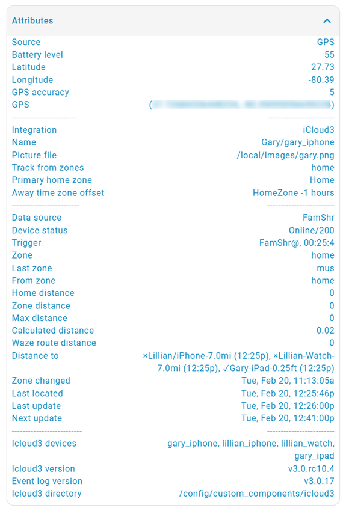
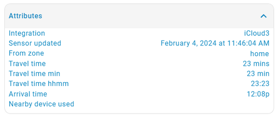
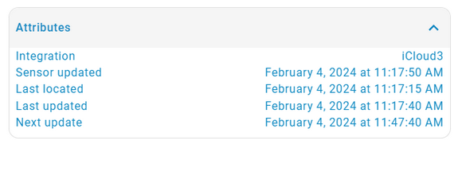
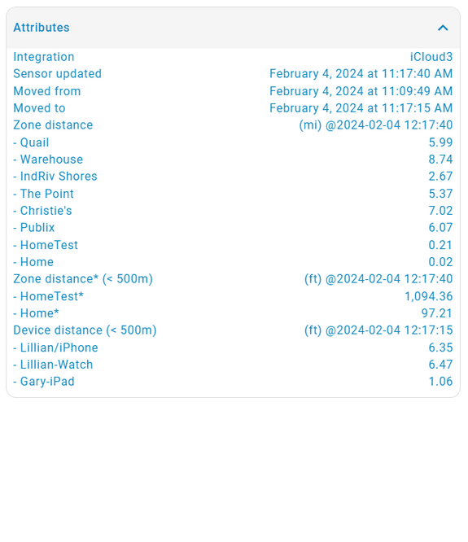
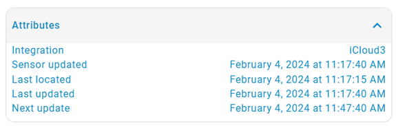

# iCloud3 Attributes

Many attributes are updated when the device is polled for it's location, distance and the travel time from Home or another zone. They can be used in automations and scripts and displayed on Lovelace Cards.  Sensors are created also for many of the attributes and are discussed in further detail in the Sensors chapter.

The following shows the attributes for the *device_tracker.gary_iphone* entity.

### Location and Polling Attributes

The following attributes are all based on the zone's location. The information for the Home zone is always calculated. They are also calculated when another zone is found on the *devices/device_name* parameter for a device. You can have more than one zone on the configuration parameter for a device. See *Chapter 2.1 - Configuration Parmeters* for more information.

!> The device_tracker.devicename_attributes always show the information as it relates to the Home zone. Additional sensors are created for the distance and time information that is calculated for the other zones.

### Attributes for Various Sensors

The following table shows screenshots of the attributes for various types of sensors that are updated by iCloud3.

| Device Tracker Entity                       | Badge Sensor                       |
| ---------------------------------- | ------------------------------------ |
|  |  |

| Battery Sensor   | Arrival Time Sensor when in a zone |
| ------------------------------------------------------------ | ------------------------------------------------------------ |
|  |  |

| Travel Time, Travel Time Minutes, Arrival Time Sensors | Located, Last Located, Next Update Sensors |
| ------------------------------------------------------ | ------------------------------------------ |
|                    |            |

| Distance Sensor                       | Distance Moved Sensor                     |
| ---------------------------------- | ------------------------------------ |
|  |  |

| Interval Sensor                       |  |
| ---------------------------------- | ------------------------------------ |
|  |  |
