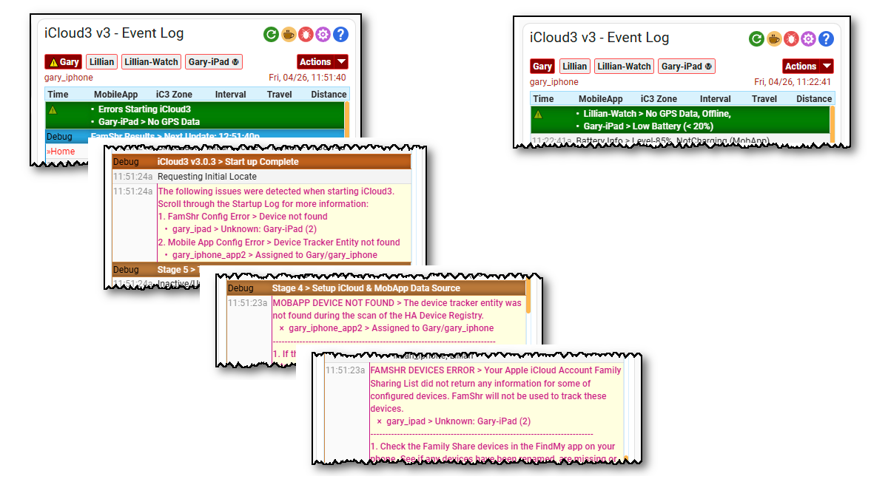

# iCloud3 Alerts

iCloud3 constantly monitors the status of the devices and displays alert messages when a problem is noticed. These alerts include:

- A Startup Error with messages in the Event Log that should be reviewed
- No GPS Data
- A device is Offline
- A device has not been located in over 5-hours
- Tracking is Paused
- The device battery is below 20%



### Attribute Attributes {docsify-ignore}

The alerts are also updated in the iCloud3 Event Log sensor entity `sensor.icloud3_event_log`. See the following example automations to see how the attributes can be used

- Startup alerts - `alert_startup`
- Tracked devices - `alert_tracked`
- Monitored devices - `alert_monitored`
- Summary of all alerts - `alerts`


### Example Automations {docsify-ignore}

The following automations are examples that will send a message with the alert information to an iPhone. 


- **Startup Alerts**
  ```
  alias: iCloud3 Alert Message (Startup)
  description: Send an Alert Msg (Startup Alerts)
  trigger:
    - platform: state
      entity_id:
        - sensor.icloud3_event_log
      attribute: alert_startup
      for:
        hours: 0
        minutes: 0
        seconds: 0
  condition:
    - condition: template
      value_template: "{{ state_attr('sensor.icloud3_event_log', 'alert_startup') != '' }}"
    - condition: template
      value_template: >-
        {{ trigger.to_state.attributes.alert_startup !=
        trigger.from_state.attributes.alert_startup }}
  action:
    - service: notify.mobile_app_gary_iphone_app
      data_template:
        title: iCloud3 Alert-Startup Events
        message: "{{ state_attr('sensor.icloud3_event_log', 'alert_startup') }}"
  mode: single
  ```

  

- **Tracked Devices Alerts**
  ```
  alias: iCloud3 Alert Message (Tracked)
  description: Send an Alert Msg (Tracked Devices Alerts)
  trigger:
    - platform: state
      entity_id:
        - sensor.icloud3_event_log
      attribute: alert_tracked
      for:
        hours: 0
        minutes: 0
        seconds: 0
  condition:
    - condition: template
      value_template: "{{ state_attr('sensor.icloud3_event_log', 'alert_tracked') != '' }}"
    - condition: template
      value_template: >-
        {{ trigger.to_state.attributes.alert_tracked !=
        trigger.from_state.attributes.alert_tracked }}
  action:
    - service: notify.mobile_app_gary_iphone_app
      data_template:
        title: iCloud3 Alert-Tracked Devices
        message: "{{ state_attr('sensor.icloud3_event_log', 'alert_tracked') }}"
  mode: single
  ```

  

- **Monitored Devices Alerts**

  ```
  alias: iCloud3 Alert Message (Monitored)
  description: Send an Alert Msg (Monitored Devices Alerts)
  trigger:
    - platform: state
      entity_id:
        - sensor.icloud3_event_log
      attribute: alert_monitored
      for:
        hours: 0
        minutes: 0
        seconds: 0
  condition:
    - condition: template
      value_template: "{{ state_attr('sensor.icloud3_event_log', 'alert_monitored') != '' }}"
    - condition: template
      value_template: >-
        {{ trigger.to_state.attributes.alert_monitored !=
        trigger.from_state.attributes.alert_monitored }}
  action:
    - service: notify.mobile_app_gary_iphone_app
      data_template:
        title: iCloud3 Alert-Monitored Devices
        message: "{{ state_attr('sensor.icloud3_event_log', 'alert_monitored') }}"
  mode: single
  ```

  

- **Summary of all Alerts**

  ```
  alias: iCloud3 Alert Message (Summary)
  description: Send and Alert Msg (Summary)
  trigger:
    - platform: state
      entity_id:
        - sensor.icloud3_event_log
      attribute: alerts
      for:
        hours: 0
        minutes: 0
        seconds: 0
  condition:
    - condition: template
      value_template: "{{ state_attr('sensor.icloud3_event_log', 'alerts') != '' }}"
    - condition: template
      value_template: >-
        {{ trigger.to_state.attributes.alerts !=
        trigger.from_state.attributes.alerts }}
  action:
    - service: notify.mobile_app_gary_iphone_app
      data_template:
        title: iCloud3 Alert-Summary
        message: "{{ state_attr('sensor.icloud3_event_log', 'alerts') }}"
  mode: single
  ```

  
