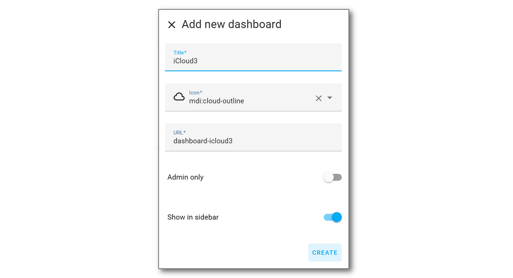

# Installing iCloud3

There are several steps that that need to be done to install and start using iCloud3 to track your devices. They are:

1. Install iCloud3 from HACS (or manually).
2. Install and configure the HA Mobile App if you are using it on any of your tracked devices. 
3. Set up the Lovelace Resource entry for the Event Log custom card component.
4. Add the iCloud3 integrations component which adds iCloud3 and it's *Configure Settings* screens. 
5. Open the *Configure Settings > Menu Page 1* screen. 
6. Open the *iCloud Account & Mobile App* screen and set up your Apple iCloud account.
7. Log into your iCloud account and enter the 6-digit verification code. 
8. Open the *iCloud3 Tracked Devices* and add your iPhone to the tracked device list. 
9. Set up a Lovelace card for for your iPhone.
10. Set up a Lovelace card for the Event Log. 
11. Restart Home Assistant.

These steps are described below.


------
### Step #1 - Install iCloud3

iCloud3 is not available on the HACS base integration yet. It will be added as an update to iCloud3 v2 once it has been released for general usage and has a sufficient number of users to insure a smooth transition. There are almost 7000 users now and  supporting a large number of people that might upgrade it at the same time is not feasible.

However, it can be added to HACS as a custom repository. This provides all the benefits of HACS and ensures a smooth rollout.

#### Installing with HACS

1. Open HACS.

2. Type **iCloud3** in the Search bar.

   Two items may be listed for iCloud3.

   - **iCloud3 v3 iDevice Tracker** - The official version of iCloud3
   - **iCloud3 v3, iDevice Tracker, Dev Edition** - An early release/beta version with changes that have not been released. You must have beta versions enabled in HACS to see this option.

3. Select the 3-vertical dots  **'⋮' ** on the **iCloud3 v3 iDevice Tracker** line, then select **Download** or **Redownload** to download iCloud3.

4. **Restart Home Assistant**

   iCloud3 will be installed into the *config/custom_components/icloud3* directory.

   


#### Manual Installation from the iCloud3 Repository Releases Page

1. Go to  the iCloud3 GitHub repository at *https://github.com/gcobb321/icloud3/releases* page.
2. Scroll down to display the *Assets* at the bottom.
3. Select **icloud3.zip**. The file save screen is displayed, select the location on your computer and save the zip file.
4. **Unzip icloud3.zip** into the *config/custom_components/icloud3* directory on your Home Assistant server (ex.: Raspberry Pi)
5. **Restart Home Assistant**

!> The Development Version of iCloud3 is at  *https://github.com/gcobb321/icloud3_v3/releases*


### Add the iCloud3 Integration

iCloud3 is a Home Assistant Integration and is configured on the Integrations screens like all the other Integrations you may be using.

1. Select **☰ > HA Settings > Devices & Services > Integrations**.
2. Select **+ Add Integration** in the lower-right hand corner.
3. Type **iCloud3**. Then select **iCloud3 v3** from the list of Integrations. *Do not select iCloud3, it is v2.4 if it is displayed.* The iCloud3 v3 entry will be added to the *Integrations* screen.
4. Open the *Configure Settings* screen.
   - **New Install** - Select **☰ > HA  Settings > Devices & Services > Integrations**.
   - **Reinstall, Event Log has been set up** - Select the   **Configure Icon** shortcut on the *Event Log screen* 
5. Select **Configure**


### Set up a Dashboard/Lovelace Tracking Card

At this point, you have not installed the iCloud3 integration, you have only installed the iCloud3 files. However, it will be easier to see what is going on if you setup the iCloud3 Dashboard first. 

!> A lot of **Undefined** field values will be displayed because you will be referencing sensor entities that have not been created yet. They will be created later.

You will set up the screen below. It is an example screen that shows the current status for Gary's iPhone (*gary_iphone*). 

-  **Left Side** - Shows the device_tracker and various sensor entities for the two devices showing the distance and travel time from Home, the interval between location requests and when the next request will be made, the battery level, and when it was last located.
- **Right Side** - The Event Log for Gary while traveling towards home.


#### Create the Dashboard

Create the iCloud3 Dashboard that will sit in the HA toolbar along the left-side of the screen.

1. Select **☰ > HA Settings > Dashboards**.

2. Select **+ Add Dashboard**.

3. Select **New dashboard from scratch**

   

4. Enter the following:
   - **iCloud3** in the *Title* field
   - **cloud-outline** in the *Icon* field
   - **dashboard-icloud3** will be automatically filled in into the *URL* field

5. Select **Create**. The Dashboard list screen is redisplayed.

   The iCloud3 Dashboard will be created and the icon is displayed on the HA Sidebar. The screen will be blank, Home will be displayed in the title bar at the top.

#### Create the Device Tracking sensor display (Left Side) and Event Log (right side)

Generally, you will be creating the Lovelace card above by copying the raw yaml code below and saving it. The code below is for the *device_tracker.gary_iphone* entity which does not exist.  Once you create it, you will change the *gary_iphone* to the device_tracker entity name you create for your tracked device. Typically this is the iPhone's name on the *Settings > General > About > Name field* of your iPhone. When you configure iCloud3 and add your Apple account and your device with this name, iCloud3 will restart and everything will be displayed.

1. Select the iCloud3 Dashboard on the HA Sidebar.

2. Select the **Edit Dashboard** pencil on the top-right.

3. Select the  3-vertical dots  **'⋮' ** on the top-right. Then select **Raw configuration editor**

4. **Erase the following code** that HA adds to the beginning of the Lovelace yaml code editor:	

   ```yaml
   views:
     - title: Home
   ```


5. **Copy the following code** below into the blank editor area. This code is for the *gary_iphone* device_tracker entity on the left-side of the screen above. 
6. Change the *gary_iphone* text to your iPhone's name. When you add it to iCloud3 later, your tracking information will be displayed on the dashboard. Right now, these fields will display *Undefined* and the Event Log will display as missing.

```yaml
title: iCloud3
views:
  - title: iCloud3
    cards:
      - square: false
        columns: 1
        type: grid
        cards:
          - type: glance
            state_color: true
            show_name: true
            show_icon: true
            show_state: true
            columns: 5
            entities:
              - entity: device_tracker.gary_iphone
                name: Gary
              - entity: sensor.gary_iphone_arrival_time
                name: Arrive
              - entity: sensor.gary_iphone_zone_distance
                name: Distance
              - entity: sensor.gary_iphone_travel_time
                name: TravTime
              - entity: sensor.gary_iphone_next_update
                name: NextUpdt
          - type: glance
            columns: 5
            entities:
              - entity: sensor.gary_iphone_battery
                name: Battery
              - entity: sensor.gary_iphone_interval
                name: Interval
              - entity: sensor.gary_iphone_moved_distance
                name: Moved
              - entity: sensor.gary_iphone_last_located
                name: Located
              - entity: sensor.gary_iphone_last_update
                name: LastUpdt
          - type: entities
            entities:
              - entity: sensor.gary_iphone_info
                name: Info
                icon: mdi:information-outline
  
  - title: iCloud3 Event Log
    path: icloud3-event-log
    cards:
      - type: custom:icloud3-event-log-card

```


#### Add the Event Log to the Lovelace Card

!> If you followed the above instructions, it has already been created and you will not have to create it here

The Event Log shows the status of iCloud3 operations. It displays a lot of information on how iCloud3 starts and on provides the tracking events for all of the devices being tracked and monitored.


The Event Log is a custom card and HA looks for it in the /www directory. 

- When iCloud3 was installed, the *icloud3-event-log-card.js* file was copied from the *icloud3/event_log_card* directory to the */www/icloud3* directory (or another custom_card directory you might have set up for iCloud3 v2).

-  When iCloud3 starts, it does the following:
  - Determine if the Event Log in the */www/icloud3* directory is the latest version. If not, it is updated. A browser refresh will be needed it it was updated. A notification is displayed on each device that a refresh is needed. 

    Note: The notification will not be displayed when it is first installed, it is only displayed on an update.

  - Determine if the Lovelace Resource list contains the Event Log and if the directory is correct. It will be added or updated if that is needed.

When you created the Lovelace card above, you added the statements for the Event Log. They are after all of the other statements.

       - type: grid
         square: false
         columns: 1
         cards:
           - type: custom:icloud3-event-log-card

Hopefully, the Event Log displayed correctly. If it did not display and *Custom element doesn't exist icloud3-event-log-card* error message displayed instead, the Event Log needs to be added to the Lovelace Resources.


#### Step 5.4 - Set up the *icloud3-event-log-card* Lovelace Resource (if needed)

The Lovelace Resources points to the location of the *icloud3-event-log-card.js* file and must be set up for the Event Log to be displayed.  If a problem occurs setting up the Lovelace Resource automatically, the Event Log (on the right in the above screenshot) will not be displayed and the following will be displayed instead:


Do the following to set it up manually:

1. Select **☰ > HA Settings > Dashboards > ⋮ (Upper right corner) > Resources**. The following screen is displayed:

   

2. Select **+ Add Resource** to open the Add Resources window (on the left).


3. Enter the following:

   - **/local/icloud3/icloud3-event-log-card.js** in the **URL** field
   - Check **JavaScript Module**
4. Select **Create (or Update)**

> *Note: Using another custom card directory* - If you move the Event Log card to another directory, the Lovelace Resources should automatically be changed. If something happens and it is not changed, change the directory (*icloud3*) in the URL statement on the above screen to the new directory name. Then select the new directory name in the *Event Log Directory* field on the *iCloud3 Configure Settings > Menu Page 2 > Other Parameters*  screen.


------
### Congratulations, iCloud3 is set up

 If you successfully added the Lovelace tracking, Event Log card and the tracking data is displayed, you have successfully set up iCloud3 and Home Assistant does not have to be restarted, Review the rest of the documentation and the parameter screens


-----

### Installation Notes

The following Installation Notes are not part of the actual installation process but may be useful.

### Restart Home Assistant (if necessary)

If something does not work, errors or alerts are displayed or iCloud3 does not begin tracking devices, restart Home Assistant may solve the problem.

When iCloud3 starts, it follows a startup process to:

- Check the directory settings
- Load the configuration parameters
- Load the tracked and monitored devices
- Access the your iCloud account to get the devices tied to your account
- Get the information for the devices using the HA Mobile App
- Tie everything together
- Start tracking. 

The results of this process are shown in the Event Log and detailed in *Event Log During Startup* in a previous chapter. 

- Check the Event Log (it should display something) for error messages.
- Check the HA Log file (*config/home-assistant.log*)
- Verify that the device_tracker and sensor entities are set up. The *Devices & Settings > Integrations > iCloud3* entry should show at least one device_tracker and some entities for that device.


-----

### Clearing the Browser's Cache

When the a new version of the *Event Log card* is installed, it is not automatically loaded by your browser or the Mobile App. The browser's cache needs to be cleared.

#### Clear the Browser's Cache (Chrome, Edge, Safari, MacOS) {docsify-ignore}

The browser (Chrome, Edge, Safari) stores the Home Assistant screens in it's cache. This needs to be cleared to load the new version of the Event Log card.

1. Press **Ctrl-Shift-Delete**.
2. Select **Cached Images and Files**, the select **Clear Data**
3. Return to the Lovelace screen and click the **Refresh Icon**. 

Note: This process may be different for MacOS.


#### Clear the Home Assistant Mobile (Mobile App) Cache  {docsify-ignore}

The cache needs to be cleared when a new version of the Event Log is installed. A message, with instructions, is displayed when this is needed. It will need to be cleared on every device (iPhones, iPads) that is using the Mobile App. 

1. In the *Home Assistant Mobile App*, tap **☰ > HA Settings > Mobile App.**
2. Tap **Debugging > Reset front end cache**
3. Tap **Settings > Done**
4. Redisplay one of the Lovelace screens and pull it down to reload the screens.


-----

### iCloud3 Log File

iCloud3 writes logging records to the */config/icloud3-0.log* file based on the Log Level configuration setting. This includes:

- **Info** - Informative messages that display tracking results and some messages on it's operations,
- **Debug** - Debug messages that provide a lot more information on the data received from the Mobile App and the iCloud account, it's operational status, error messages and other records on how the devices are being tracked,
- **Rawdata** - Rawdata messages log the actual records sent to and received from the iCloud account, actual data received from the Mobile App, how zones, devices and sensors are set up and event activity during when iCloud3 is starting. The data received from Apple Location Services is filtered to remove any fields that are not used by iCloud3.
- **Unfiltered** - Displays the same rawdata described above without any filters. Every data field received from Apple Location Servers is displayed.

> The Log Level configuration setting is on the *Configure Settings > Page 2 > Format Parameters* screen. Some can also be selected on the *Event Log > Actions* list.

*Notes*: 
- All records are written to the *icloud3-0.log* file. A new file is created if the Log Level is Debug.
- The log file is closed at midnight and renamed *icloud3-1.log*. A new file is created for the new day.
- Log Level Debug and Rawdata have an  Auto-Reset option that will reset the Log Level to Info at midnight.
